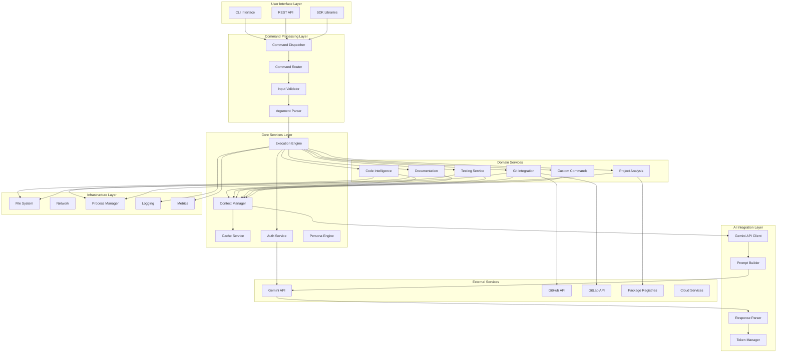
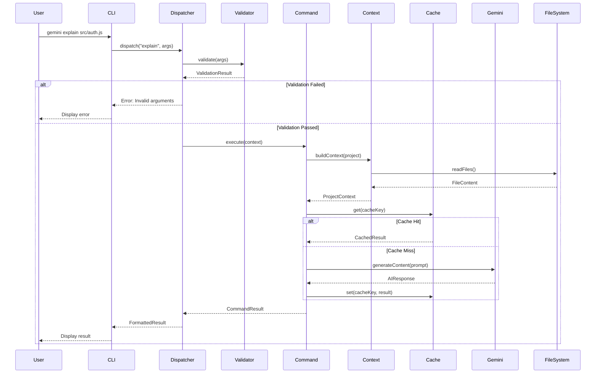

# CLAUDE Architecture: Gemini CLI AI Developer Toolkit

**Document Version:** 1.0  
**Date:** 2025-01-27  
**Status:** Production Architecture  
**Alignment:** CLAUDE-BUILD-PLAN.md v2.0  
**Platform Support:** Windows, macOS, Linux  

---

## 🎯 MVP Implementation Scope

> **Important**: This comprehensive architecture document covers the **complete vision** for the Gemini CLI AI Developer Toolkit. For **MVP development focus**, see [CLAUDE-BUILD-PLAN.md](./CLAUDE-BUILD-PLAN.md) which prioritizes:
> - **11 Essential Commands** for 6-week MVP delivery
> - **Security-First Implementation** with defense-in-depth
> - **Production-Ready Foundation** that scales to full architecture
> 
> **Security Priority**: All architectural decisions prioritize security over convenience. This toolkit handles sensitive code, API keys, and has broad system access - security is non-negotiable.

---

## Table of Contents

1. [Executive Summary](#executive-summary)
2. [System Overview](#system-overview)
3. [Core Architecture Principles](#core-architecture-principles)
4. [System Components](#system-components)
5. [Data Flow Architecture](#data-flow-architecture)
6. [Security Architecture](#security-architecture)
7. [Performance Architecture](#performance-architecture)
8. [Deployment Architecture](#deployment-architecture)
9. [Integration Architecture](#integration-architecture)
10. [Scalability & Reliability](#scalability--reliability)

---

## Executive Summary

The Gemini CLI AI Developer Toolkit is a comprehensive, modular, and extensible system that transforms software development through AI-powered automation. This document outlines the technical architecture supporting 42+ intelligent commands across 6 major categories, designed for cross-platform operation with enterprise-grade security and performance.

### Key Architectural Highlights

- **Microservices-Inspired Modular Design**: Each command operates as an independent module
- **Event-Driven Command Processing**: Asynchronous, non-blocking architecture
- **Intelligent Caching Layer**: 4x cost reduction through context caching
- **Cross-Platform Abstraction**: Unified API across Windows/macOS/Linux
- **Plugin Architecture**: Extensible through custom commands and templates
- **Subscription-Aware Resource Management**: Dynamic scaling based on tier

---

## System Overview

### High-Level Architecture Diagram



### Component Interaction Matrix

| Component | Interacts With | Communication Method | Data Format |
|-----------|---------------|---------------------|-------------|
| CLI Interface | Command Dispatcher | Direct Function Call | JSON |
| Command Dispatcher | Command Router | Event Bus | Command Object |
| Command Router | Domain Services | Dependency Injection | Service Interface |
| Domain Services | Gemini Client | Async/Await | Request/Response |
| Gemini Client | Gemini API | HTTPS REST | JSON |
| Cache Service | All Services | In-Memory/Redis | Key-Value |
| File System | All Services | Node.js FS API | Binary/Text |

---

## Core Architecture Principles

### 1. Separation of Concerns

Each architectural layer has distinct responsibilities:

- **Presentation Layer**: User interaction and display
- **Business Logic Layer**: Command processing and orchestration
- **Service Layer**: Domain-specific operations
- **Data Layer**: Storage and caching
- **Integration Layer**: External service communication

### 2. Command Pattern Architecture

```typescript
interface Command {
  name: string;
  description: string;
  category: CommandCategory;
  execute(context: CommandContext): Promise<CommandResult>;
  validate(args: CommandArgs): ValidationResult;
  getRequiredPermissions(): Permission[];
  getSupportedPlatforms(): Platform[];
}

abstract class BaseCommand implements Command {
  protected geminiClient: GeminiClient;
  protected cacheService: CacheService;
  protected logger: Logger;
  
  constructor(dependencies: CommandDependencies) {
    this.geminiClient = dependencies.geminiClient;
    this.cacheService = dependencies.cacheService;
    this.logger = dependencies.logger;
  }
  
  async execute(context: CommandContext): Promise<CommandResult> {
    try {
      this.logger.info(`Executing command: ${this.name}`);
      
      // Validate inputs
      const validation = this.validate(context.args);
      if (!validation.isValid) {
        throw new ValidationError(validation.errors);
      }
      
      // Check cache
      const cacheKey = this.getCacheKey(context);
      const cached = await this.cacheService.get(cacheKey);
      if (cached && !context.options.noCache) {
        return cached;
      }
      
      // Execute command logic
      const result = await this.executeInternal(context);
      
      // Cache result
      await this.cacheService.set(cacheKey, result);
      
      return result;
    } catch (error) {
      this.logger.error(`Command failed: ${error.message}`);
      throw error;
    }
  }
  
  protected abstract executeInternal(context: CommandContext): Promise<CommandResult>;
}
```

### 3. Plugin Architecture

```typescript
interface Plugin {
  name: string;
  version: string;
  commands?: Command[];
  templates?: Template[];
  hooks?: Hook[];
  
  initialize(context: PluginContext): Promise<void>;
  shutdown(): Promise<void>;
}

class PluginManager {
  private plugins: Map<string, Plugin> = new Map();
  
  async loadPlugin(pluginPath: string): Promise<void> {
    const plugin = await this.loadPluginModule(pluginPath);
    await plugin.initialize(this.context);
    
    // Register commands
    plugin.commands?.forEach(cmd => this.registerCommand(cmd));
    
    // Register templates
    plugin.templates?.forEach(tpl => this.registerTemplate(tpl));
    
    // Register hooks
    plugin.hooks?.forEach(hook => this.registerHook(hook));
    
    this.plugins.set(plugin.name, plugin);
  }
}
```

### 4. Cross-Platform Abstraction

```typescript
interface PlatformAdapter {
  execute(command: string, args: string[]): Promise<ExecutionResult>;
  getEnvironmentVariables(): Record<string, string>;
  getHomePath(): string;
  getConfigPath(): string;
  normalizeTextFormat(text: string): string;
  supportedShells(): Shell[];
}

class WindowsPlatformAdapter implements PlatformAdapter {
  async execute(command: string, args: string[]): Promise<ExecutionResult> {
    return await this.executePowerShell(command, args);
  }
  
  getHomePath(): string {
    return process.env.USERPROFILE || 'C:\\Users\\Default';
  }
  
  normalizeTextFormat(text: string): string {
    return text.replace(/\n/g, '\r\n');
  }
}

class UnixPlatformAdapter implements PlatformAdapter {
  async execute(command: string, args: string[]): Promise<ExecutionResult> {
    const shell = process.env.SHELL || '/bin/bash';
    return await this.executeShell(shell, command, args);
  }
  
  getHomePath(): string {
    return process.env.HOME || '/home/user';
  }
}

class PlatformFactory {
  static create(): PlatformAdapter {
    switch (process.platform) {
      case 'win32': return new WindowsPlatformAdapter();
      case 'darwin': return new MacOSPlatformAdapter();
      default: return new LinuxPlatformAdapter();
    }
  }
}
```

---

## System Components

### 1. Command Dispatcher

**Responsibility**: Central command orchestration and lifecycle management

```typescript
class CommandDispatcher {
  private commandRegistry: CommandRegistry;
  private middleware: Middleware[];
  private eventBus: EventBus;
  
  async dispatch(commandName: string, args: CommandArgs): Promise<CommandResult> {
    // Emit pre-execution event
    await this.eventBus.emit('command:pre-execute', { commandName, args });
    
    // Apply middleware
    const context = await this.applyMiddleware(args);
    
    // Get command
    const command = this.commandRegistry.get(commandName);
    if (!command) {
      throw new CommandNotFoundError(commandName);
    }
    
    // Check permissions
    await this.checkPermissions(command, context);
    
    // Execute command
    const result = await command.execute(context);
    
    // Emit post-execution event
    await this.eventBus.emit('command:post-execute', { commandName, result });
    
    return result;
  }
}
```

### 2. Gemini API Client

**Responsibility**: Manage all interactions with Gemini API

```typescript
class GeminiAPIClient {
  private client: GoogleGenAI;
  private rateLimiter: RateLimiter;
  private retryManager: RetryManager;
  private subscription: SubscriptionTier;
  
  async generateContent(request: GeminiRequest): Promise<GeminiResponse> {
    // Check rate limits
    await this.rateLimiter.acquire();
    
    // Select optimal model based on subscription
    const model = this.selectModel(request);
    
    // Build prompt with context
    const prompt = await this.buildPrompt(request);
    
    // Execute with retry logic
    const response = await this.retryManager.execute(async () => {
      return await this.client.generateContent({
        model,
        contents: prompt,
        config: this.getConfig(request)
      });
    });
    
    // Track usage
    await this.trackUsage(response);
    
    return response;
  }
  
  private selectModel(request: GeminiRequest): GeminiModel {
    if (request.complexity === 'high' && this.subscription.tier >= 2) {
      return 'gemini-2.5-pro';
    } else if (this.subscription.tier >= 1) {
      return 'gemini-2.5-flash';
    } else {
      return 'gemini-2.5-flash-lite';
    }
  }
}
```

### 3. Context Manager

**Responsibility**: Manage project context and token optimization

```typescript
class ContextManager {
  private projectAnalyzer: ProjectAnalyzer;
  private tokenCalculator: TokenCalculator;
  private contextCache: ContextCache;
  
  async buildContext(projectPath: string, options: ContextOptions): Promise<Context> {
    // Analyze project structure
    const projectInfo = await this.projectAnalyzer.analyze(projectPath);
    
    // Build file context
    const files = await this.selectRelevantFiles(projectInfo, options);
    
    // Calculate token usage
    const tokenCount = this.tokenCalculator.calculate(files);
    
    // Compress if needed
    if (tokenCount > options.maxTokens) {
      files = await this.compressContext(files, options.maxTokens);
    }
    
    // Build final context
    return {
      projectInfo,
      files,
      tokenCount,
      metadata: this.buildMetadata(projectInfo)
    };
  }
  
  private async selectRelevantFiles(
    projectInfo: ProjectInfo,
    options: ContextOptions
  ): Promise<FileContext[]> {
    // Intelligent file selection based on command type
    const strategy = this.getSelectionStrategy(options.command);
    return await strategy.select(projectInfo);
  }
}
```

### 4. Cache Service

**Responsibility**: Intelligent caching for performance and cost optimization

```typescript
class CacheService {
  private memoryCache: LRUCache;
  private diskCache: DiskCache;
  private distributedCache?: RedisCache;
  
  async get(key: string): Promise<any> {
    // Check memory cache first
    let value = this.memoryCache.get(key);
    if (value) return value;
    
    // Check disk cache
    value = await this.diskCache.get(key);
    if (value) {
      this.memoryCache.set(key, value);
      return value;
    }
    
    // Check distributed cache if available
    if (this.distributedCache) {
      value = await this.distributedCache.get(key);
      if (value) {
        await this.diskCache.set(key, value);
        this.memoryCache.set(key, value);
        return value;
      }
    }
    
    return null;
  }
  
  async set(key: string, value: any, ttl?: number): Promise<void> {
    // Write through all cache layers
    this.memoryCache.set(key, value, ttl);
    await this.diskCache.set(key, value, ttl);
    
    if (this.distributedCache) {
      await this.distributedCache.set(key, value, ttl);
    }
  }
}
```

### 5. Template Engine

**Responsibility**: Manage code generation templates

```typescript
class TemplateEngine {
  private templateLoader: TemplateLoader;
  private templateCompiler: TemplateCompiler;
  private styleAnalyzer: StyleAnalyzer;
  
  async generate(
    templateName: string,
    variables: Record<string, any>,
    projectContext: ProjectContext
  ): Promise<GeneratedCode> {
    // Load template (local overrides global)
    const template = await this.templateLoader.load(templateName);
    
    // Analyze project style
    const styleGuide = await this.styleAnalyzer.analyze(projectContext);
    
    // Compile template with variables
    const compiled = await this.templateCompiler.compile(template, {
      ...variables,
      style: styleGuide
    });
    
    // Format according to project conventions
    const formatted = await this.formatCode(compiled, projectContext);
    
    return {
      code: formatted,
      files: this.splitIntoFiles(formatted, template.fileStructure)
    };
  }
}
```

---

## Data Flow Architecture

### Command Execution Flow



### Token Management Flow

```typescript
class TokenManager {
  private subscription: SubscriptionTier;
  private usageTracker: UsageTracker;
  
  async optimizeTokenUsage(content: string, limit: number): Promise<string> {
    const currentTokens = this.calculateTokens(content);
    
    if (currentTokens <= limit) {
      return content;
    }
    
    // Progressive optimization strategies
    const strategies = [
      new CompressionStrategy(),
      new SummarizationStrategy(),
      new ChunkingStrategy(),
      new PrioritizationStrategy()
    ];
    
    for (const strategy of strategies) {
      content = await strategy.optimize(content, limit);
      if (this.calculateTokens(content) <= limit) {
        break;
      }
    }
    
    return content;
  }
  
  private calculateTokens(content: string): number {
    // Approximate: 1 token ≈ 3.5 characters for code
    const baseTokens = Math.ceil(content.length / 3.5);
    
    // Apply content-type adjustments
    const contentType = this.detectContentType(content);
    const multiplier = {
      'code': 1.1,
      'documentation': 0.9,
      'json': 1.2,
      'markdown': 1.0
    }[contentType] || 1.0;
    
    return Math.ceil(baseTokens * multiplier);
  }
}
```

---

## Security Architecture

### Security Layers

```typescript
class SecurityManager {
  private authService: AuthService;
  private encryptionService: EncryptionService;
  private auditLogger: AuditLogger;
  private rateLimiter: RateLimiter;
  
  async validateRequest(request: Request): Promise<SecurityContext> {
    // Authentication
    const user = await this.authService.authenticate(request);
    
    // Authorization
    const permissions = await this.authService.authorize(user, request.command);
    
    // Input validation
    this.validateInput(request.args);
    
    // Rate limiting
    await this.rateLimiter.checkLimit(user, request.command);
    
    // Audit logging
    await this.auditLogger.log({
      user,
      command: request.command,
      timestamp: new Date(),
      ip: request.ip
    });
    
    return {
      user,
      permissions,
      encryptionKey: await this.encryptionService.getKey(user)
    };
  }
  
  private validateInput(args: any): void {
    // Path traversal prevention
    if (this.detectPathTraversal(args)) {
      throw new SecurityError('Path traversal detected');
    }
    
    // Command injection prevention
    if (this.detectCommandInjection(args)) {
      throw new SecurityError('Command injection detected');
    }
    
    // SQL injection prevention (for database commands)
    if (this.detectSQLInjection(args)) {
      throw new SecurityError('SQL injection detected');
    }
  }
}
```

### API Key Management

```typescript
class APIKeyManager {
  private keyStore: SecureKeyStore;
  private encryption: EncryptionService;
  
  async storeAPIKey(key: string, service: string): Promise<void> {
    const encrypted = await this.encryption.encrypt(key);
    
    // Platform-specific secure storage
    if (process.platform === 'darwin') {
      await this.storeInKeychain(encrypted, service);
    } else if (process.platform === 'win32') {
      await this.storeInCredentialManager(encrypted, service);
    } else {
      await this.storeInSecretService(encrypted, service);
    }
  }
  
  async getAPIKey(service: string): Promise<string> {
    const encrypted = await this.retrieveFromSecureStore(service);
    return await this.encryption.decrypt(encrypted);
  }
}
```

---

## Performance Architecture

### Performance Optimization Strategies

```typescript
class PerformanceOptimizer {
  private metricsCollector: MetricsCollector;
  private performanceCache: PerformanceCache;
  
  async optimizeCommandExecution(command: Command): Promise<OptimizedCommand> {
    // Collect baseline metrics
    const baseline = await this.metricsCollector.getBaseline(command);
    
    // Apply optimizations
    const optimizations = [
      new ParallelExecutionOptimization(),
      new LazyLoadingOptimization(),
      new StreamProcessingOptimization(),
      new BatchProcessingOptimization()
    ];
    
    let optimizedCommand = command;
    for (const optimization of optimizations) {
      if (optimization.applicable(command, baseline)) {
        optimizedCommand = await optimization.apply(optimizedCommand);
      }
    }
    
    return optimizedCommand;
  }
}

class StreamProcessingOptimization {
  apply(command: Command): Command {
    return new StreamingCommand({
      ...command,
      execute: async function*(context: CommandContext) {
        const chunks = this.splitIntoChunks(context);
        for (const chunk of chunks) {
          yield await this.processChunk(chunk);
        }
      }
    });
  }
}
```

### Resource Management

```typescript
class ResourceManager {
  private memoryMonitor: MemoryMonitor;
  private cpuMonitor: CPUMonitor;
  private diskMonitor: DiskMonitor;
  
  async allocateResources(command: Command): Promise<ResourceAllocation> {
    const requirements = command.getResourceRequirements();
    
    // Check available resources
    const available = {
      memory: await this.memoryMonitor.getAvailable(),
      cpu: await this.cpuMonitor.getAvailable(),
      disk: await this.diskMonitor.getAvailable()
    };
    
    // Allocate within limits
    const allocation = {
      memory: Math.min(requirements.memory, available.memory * 0.7),
      cpu: Math.min(requirements.cpu, available.cpu * 0.8),
      disk: Math.min(requirements.disk, available.disk * 0.9)
    };
    
    // Set process limits
    if (process.platform !== 'win32') {
      process.setrlimit('AS', allocation.memory);
      process.setrlimit('CPU', allocation.cpu);
    }
    
    return allocation;
  }
}
```

---

## Deployment Architecture

### Container Architecture

```dockerfile
# Multi-stage build for optimization
FROM node:18-alpine AS builder

WORKDIR /app
COPY package*.json ./
RUN npm ci --only=production

COPY . .
RUN npm run build

# Production image
FROM node:18-alpine

WORKDIR /app
COPY --from=builder /app/dist ./dist
COPY --from=builder /app/node_modules ./node_modules

# Security hardening
RUN addgroup -g 1001 -S gemini && \
    adduser -S gemini -u 1001
USER gemini

# Health check
HEALTHCHECK --interval=30s --timeout=3s \
  CMD node healthcheck.js || exit 1

EXPOSE 3000
CMD ["node", "dist/server.js"]
```

### Kubernetes Deployment

```yaml
apiVersion: apps/v1
kind: Deployment
metadata:
  name: gemini-cli-toolkit
spec:
  replicas: 3
  selector:
    matchLabels:
      app: gemini-cli
  template:
    metadata:
      labels:
        app: gemini-cli
    spec:
      containers:
      - name: gemini-cli
        image: gemini-cli-toolkit:latest
        resources:
          requests:
            memory: "256Mi"
            cpu: "250m"
          limits:
            memory: "512Mi"
            cpu: "500m"
        env:
        - name: GEMINI_API_KEY
          valueFrom:
            secretKeyRef:
              name: gemini-secrets
              key: api-key
        - name: REDIS_URL
          valueFrom:
            configMapKeyRef:
              name: gemini-config
              key: redis-url
        livenessProbe:
          httpGet:
            path: /health
            port: 3000
          initialDelaySeconds: 30
          periodSeconds: 10
        readinessProbe:
          httpGet:
            path: /ready
            port: 3000
          initialDelaySeconds: 5
          periodSeconds: 5
```

---

## Integration Architecture

### External Service Integration

```typescript
class IntegrationHub {
  private adapters: Map<string, ServiceAdapter> = new Map();
  
  constructor() {
    this.registerAdapter('github', new GitHubAdapter());
    this.registerAdapter('gitlab', new GitLabAdapter());
    this.registerAdapter('npm', new NPMAdapter());
    this.registerAdapter('docker', new DockerAdapter());
  }
  
  async integrate(service: string, operation: string, params: any): Promise<any> {
    const adapter = this.adapters.get(service);
    if (!adapter) {
      throw new IntegrationError(`Service ${service} not supported`);
    }
    
    return await adapter.execute(operation, params);
  }
}

class GitHubAdapter implements ServiceAdapter {
  private octokit: Octokit;
  
  async execute(operation: string, params: any): Promise<any> {
    switch (operation) {
      case 'createPR':
        return await this.createPullRequest(params);
      case 'publishWiki':
        return await this.publishWiki(params);
      case 'createRelease':
        return await this.createRelease(params);
      default:
        throw new Error(`Operation ${operation} not supported`);
    }
  }
}
```

### Webhook Architecture

```typescript
class WebhookManager {
  private webhookRegistry: WebhookRegistry;
  private eventProcessor: EventProcessor;
  
  async handleWebhook(source: string, event: WebhookEvent): Promise<void> {
    // Validate webhook signature
    if (!this.validateSignature(source, event)) {
      throw new SecurityError('Invalid webhook signature');
    }
    
    // Get registered handlers
    const handlers = this.webhookRegistry.getHandlers(source, event.type);
    
    // Process event
    await this.eventProcessor.process(event, handlers);
  }
  
  private validateSignature(source: string, event: WebhookEvent): boolean {
    const secret = this.getWebhookSecret(source);
    const signature = this.computeSignature(event.payload, secret);
    return signature === event.signature;
  }
}
```

---

## Scalability & Reliability

### Horizontal Scaling Architecture

```typescript
class LoadBalancer {
  private instances: WorkerInstance[];
  private healthChecker: HealthChecker;
  
  async distributeCommand(command: Command): Promise<CommandResult> {
    // Get healthy instances
    const healthyInstances = await this.healthChecker.getHealthyInstances();
    
    // Select instance based on load
    const instance = this.selectInstance(healthyInstances);
    
    // Execute command on selected instance
    return await instance.execute(command);
  }
  
  private selectInstance(instances: WorkerInstance[]): WorkerInstance {
    // Round-robin with load consideration
    return instances.reduce((selected, current) => {
      return current.load < selected.load ? current : selected;
    });
  }
}
```

### Fault Tolerance

```typescript
class CircuitBreaker {
  private state: 'CLOSED' | 'OPEN' | 'HALF_OPEN' = 'CLOSED';
  private failureCount: number = 0;
  private successCount: number = 0;
  private lastFailureTime?: Date;
  
  async execute<T>(operation: () => Promise<T>): Promise<T> {
    if (this.state === 'OPEN') {
      if (this.shouldAttemptReset()) {
        this.state = 'HALF_OPEN';
      } else {
        throw new CircuitOpenError('Circuit breaker is open');
      }
    }
    
    try {
      const result = await operation();
      this.onSuccess();
      return result;
    } catch (error) {
      this.onFailure();
      throw error;
    }
  }
  
  private onSuccess(): void {
    this.failureCount = 0;
    if (this.state === 'HALF_OPEN') {
      this.successCount++;
      if (this.successCount >= this.config.successThreshold) {
        this.state = 'CLOSED';
      }
    }
  }
  
  private onFailure(): void {
    this.failureCount++;
    this.lastFailureTime = new Date();
    if (this.failureCount >= this.config.failureThreshold) {
      this.state = 'OPEN';
    }
  }
}
```

### Monitoring & Observability

```typescript
class ObservabilityManager {
  private tracer: Tracer;
  private metrics: MetricsCollector;
  private logger: Logger;
  
  instrumentCommand(command: Command): Command {
    return new InstrumentedCommand({
      ...command,
      execute: async (context: CommandContext) => {
        const span = this.tracer.startSpan(`command.${command.name}`);
        const timer = this.metrics.startTimer(`command.duration`);
        
        try {
          this.logger.info('Command started', {
            command: command.name,
            context
          });
          
          const result = await command.execute(context);
          
          this.metrics.increment('command.success');
          span.setTag('status', 'success');
          
          return result;
        } catch (error) {
          this.metrics.increment('command.failure');
          span.setTag('status', 'error');
          span.setTag('error', error.message);
          
          this.logger.error('Command failed', {
            command: command.name,
            error: error.message,
            stack: error.stack
          });
          
          throw error;
        } finally {
          timer.end();
          span.finish();
        }
      }
    });
  }
}
```

---

## Architecture Decisions Records (ADRs)

### ADR-001: Microservices-Inspired Modular Architecture
**Status**: Accepted  
**Context**: Need to support 42+ commands with independent development and deployment  
**Decision**: Use modular architecture where each command is an independent module  
**Consequences**: Better maintainability, easier testing, potential for distributed deployment  

### ADR-002: Event-Driven Command Processing
**Status**: Accepted  
**Context**: Need asynchronous, non-blocking command execution  
**Decision**: Implement event bus for command lifecycle management  
**Consequences**: Better scalability, decoupled components, complex debugging  

### ADR-003: Multi-Layer Caching Strategy
**Status**: Accepted  
**Context**: Need to reduce Gemini API costs by 4x  
**Decision**: Implement memory, disk, and distributed cache layers  
**Consequences**: Significant cost reduction, increased complexity, cache invalidation challenges  

### ADR-004: Cross-Platform Abstraction Layer
**Status**: Accepted  
**Context**: Must support Windows, macOS, and Linux equally  
**Decision**: Create platform adapter pattern with unified API  
**Consequences**: Consistent behavior across platforms, additional abstraction layer  

### ADR-005: Plugin Architecture for Extensibility
**Status**: Accepted  
**Context**: Users need to create custom commands and workflows  
**Decision**: Implement plugin system with hooks and extension points  
**Consequences**: High extensibility, security considerations, API stability requirements  

---

## Technology Stack

### Core Technologies

| Layer | Technology | Justification |
|-------|------------|---------------|
| Runtime | Node.js 18+ | Cross-platform, async I/O, large ecosystem |
| Language | TypeScript 5+ | Type safety, better tooling, self-documenting |
| Framework | Commander.js | Robust CLI framework with wide adoption |
| Testing | Jest + Vitest | Fast, parallel testing with good coverage tools |
| Build | esbuild | Fast bundling, tree shaking, small output |
| Package Manager | pnpm | Faster, disk-efficient, better monorepo support |

### Infrastructure Technologies

| Component | Technology | Justification |
|-----------|------------|---------------|
| Container | Docker | Standard containerization, multi-stage builds |
| Orchestration | Kubernetes | Production-grade orchestration, auto-scaling |
| Cache | Redis | Fast in-memory cache, distributed support |
| Monitoring | Prometheus + Grafana | Industry standard metrics and visualization |
| Tracing | OpenTelemetry | Vendor-agnostic distributed tracing |
| CI/CD | GitHub Actions | Native GitHub integration, matrix builds |

### External Services

| Service | Purpose | Integration Method |
|---------|---------|-------------------|
| Gemini API | AI processing | REST API with SDK |
| GitHub API | Repository operations | Octokit SDK |
| NPM Registry | Package management | REST API |
| Docker Hub | Container registry | Docker CLI |
| AWS S3 | Artifact storage | AWS SDK |

---

## Performance Targets

### Response Time Targets

| Command Type | Target | Maximum | Notes |
|--------------|--------|---------|-------|
| Simple (explain, commit) | < 1s | 2s | Cached responses |
| Medium (scaffold, testgen) | < 3s | 5s | Template processing |
| Complex (wiki, architecture) | < 10s | 30s | Full analysis |
| Batch Operations | < 1s/item | 2s/item | Parallel processing |

### Resource Usage Targets

| Resource | Idle | Active | Peak | Notes |
|----------|------|--------|------|-------|
| Memory | < 50MB | < 256MB | < 512MB | Per command instance |
| CPU | < 1% | < 25% | < 50% | Single core equivalent |
| Disk I/O | < 1MB/s | < 10MB/s | < 50MB/s | SSD optimized |
| Network | < 10KB/s | < 100KB/s | < 1MB/s | API calls only |

### Scalability Targets

| Metric | Target | Architecture Support |
|--------|--------|---------------------|
| Concurrent Users | 10,000 | Load balancing, caching |
| Commands/Second | 1,000 | Horizontal scaling |
| Cache Hit Ratio | > 70% | Multi-layer cache |
| API Success Rate | > 99.9% | Retry, circuit breaker |

---

## Conclusion

This architecture document outlines a robust, scalable, and maintainable system design for the Gemini CLI AI Developer Toolkit. The modular architecture, combined with comprehensive security, performance optimization, and cross-platform support, provides a solid foundation for building the next generation of AI-powered development tools.

The architecture prioritizes:
1. **Modularity** - Independent, testable components
2. **Scalability** - Horizontal scaling and distributed processing
3. **Security** - Defense in depth with multiple security layers
4. **Performance** - Multi-layer caching and optimization
5. **Extensibility** - Plugin architecture for custom workflows

This design ensures the toolkit can grow from initial release to enterprise adoption while maintaining code quality, performance, and user experience across all supported platforms.