# CLAUDE Build Plan: Complete Gemini CLI AI Developer Toolkit

**Document Version:** 2.0  
**Date:** 2025-01-26  
**Status:** Implementation Ready  
**Target:** Production-Ready Comprehensive AI-Powered Developer Toolkit for Gemini CLI

---

## Executive Summary

This comprehensive build plan details the creation of a **complete AI-powered developer toolkit** that transforms how developers code, document, test, and maintain their projects. Built on the foundation of the existing context analysis system, this project creates a comprehensive suite of Gemini-powered commands that handle everything from code generation to project wikis.

**Complete Feature Set:**

- **Code Intelligence**: `explain`, `scaffold`, `debug`, `refactor`, `optimize`
- **Documentation Automation**: `docstring`, `readme`, `wiki`, `api-docs`, `changelog`
- **Testing & Quality**: `testgen`, `coverage`, `review`, `security-scan`, `performance-test`
- **Git & DevOps**: `commit`, `release-notes`, `pr-description`, `deploy-check`, `ci-fix`
- **Project Management**: `roadmap`, `backlog`, `estimate`, `dependency-audit`
- **Custom Scripts**: `run <script>` with AI-powered project-specific automation
- **Advanced Context**: Enhanced context analysis with subscription-aware optimization

**Timeline:** 24-30 weeks to complete toolkit release  
**Complexity Level:** VERY HIGH (Complete AI developer productivity ecosystem)

---

## 🚀 MVP: Production Ready in 6 Weeks

### MVP Feature Set (11 Essential Commands)

**Ready for production use after 6 weeks of development**

#### Core Commands (11 total):

1. **`gemini explain`** - Explain code files and snippets with context awareness
2. **`gemini debug`** - Analyze error messages and suggest fixes
3. **`gemini scaffold`** - Generate boilerplate code from natural language
4. **`gemini docstring`** - Auto-generate missing documentation
5. **`gemini readme`** - Generate comprehensive README files
6. **`gemini wiki`** - Generate complete GitHub wikis from codebase analysis
7. **`gemini commit`** - Generate smart conventional commit messages
8. **`gemini pr-description`** - Generate comprehensive PR descriptions
9. **`gemini testgen`** - Generate test files for existing code
10. **`gemini run <script>`** - Execute custom AI-powered scripts with personas
11. **`gemini context`** - Analyze project context and token optimization

#### MVP Technical Features:

- **Custom Personas**: Define AI personalities in TOML files
- **Cross-Platform**: Native Windows, macOS, Linux support
- **Smart Caching**: Basic file-based caching for 4x cost reduction
- **Subscription Aware**: Adapts to all Gemini subscription tiers
- **Full CI/CD**: GitHub Actions, Docker, DevContainer ready
- **Template System**: Global and local template support

#### MVP Success Metrics:

- **6-week delivery**: From start to npm publish
- **Production ready**: Full test coverage, CI/CD, documentation
- **Developer focused**: Solves 80% of daily AI coding needs
- **Extensible**: Foundation for future 42+ command expansion
- **📋 Complete Documentation**: All epic summaries, handoffs, and implementation notes

### Why This MVP Works:

1. **High Value, Low Risk**: Each command solves real daily pain points
2. **Foundation for Growth**: Architecture supports adding 30+ more commands
3. **User Validation**: Can validate concept before full investment
4. **Revenue Ready**: Production quality with subscription optimization

**🎯 MVP COMPLETE MILESTONE: Week 6 - Ready for Production Use**

#### 📋 MANDATORY MVP Deliverables:

Each epic MUST include complete documentation in `epic-summaries/` folder:

- **EPIC-SUMMARY.md**: Implementation details, decisions, metrics (max 1 page)
- **HANDOFF.md**: Key insights for next epic (max 1/2 page)
- **SUB-AGENTS/**: All sub-agent task summaries with results and files modified
- **No epic is complete without proper summaries** - this is non-negotiable

---

## 1. Project Vision & Strategic Goals (Full Roadmap)

### 1.1 Mission Statement

Create the **ultimate AI-powered developer productivity suite** for Gemini CLI that:

- **Automates 80%** of repetitive coding tasks (documentation, testing, git workflow)
- **Accelerates development velocity** by 3-5x through intelligent code generation
- **Maintains code quality** through AI-powered reviews and automated best practices
- **Scales intelligently** across all Gemini subscription tiers
- **Adapts to any project** type, language, and framework seamlessly

### 1.2 Strategic Objectives

**Primary Goals:**

1. **Complete Developer Workflow**: Cover entire development lifecycle from ideation to deployment
2. **AI-First Experience**: Every command leverages Gemini's massive context understanding
3. **Project Intelligence**: Deep understanding of codebases, patterns, and conventions
4. **Quality Automation**: Automated testing, documentation, and code review
5. **Subscription Optimization**: Intelligent feature scaling based on Gemini subscription tier

**Secondary Goals:**

1. **Ecosystem Integration**: Seamless integration with existing developer tools
2. **Template System**: Extensible templates for scaffolding and generation
3. **Community Marketplace**: Shared scripts and templates ecosystem
4. **Enterprise Features**: Team collaboration, audit trails, policy enforcement
5. **Multi-Language Support**: Universal support for all programming languages

---

## 2. Technical Architecture Overview

### 2.1 Complete System Architecture

```mermaid
graph TB
    subgraph "Gemini CLI Ecosystem"
        GC[Gemini CLI Core]
        SC[Slash Commands]
        MCP[MCP Servers]
    end

    subgraph "AI Developer Toolkit Core"
        CCE[Command Engine]
        API[Gemini API Client]
        CACHE[Smart Cache System]
        ANALYZER[Project Analyzer]
        TEMPLATE[Template Engine]
        PARSER[Code Parser/AST]
    end

    subgraph "Command Categories"
        CODE[Code Intelligence]
        DOCS[Documentation]
        TEST[Testing & Quality]
        GIT[Git & DevOps]
        PROJECT[Project Management]
        WIKI[Wiki Generation]
    end

    subgraph "Configuration & Templates"
        GLOBAL[~/.gemini/scripts/]
        LOCAL[./.gemini/scripts/]
        TEMP_GLOBAL[~/.gemini/templates/]
        TEMP_LOCAL[./.gemini/templates/]
        TOML[Command Definitions]
    end

    subgraph "Gemini API Tier"
        FLASH[Gemini 2.5 Flash]
        PRO[Gemini 2.5 Pro]
        LITE[Gemini 2.5 Flash-Lite]
        SUB[Subscription Tiers]
        BATCH[Batch API]
    end

    subgraph "External Integrations"
        GITHUB[GitHub API]
        GITLAB[GitLab API]
        WIKI_SITES[Wiki Platforms]
        AST_PARSERS[Language Parsers]
    end

    GC --> SC
    SC --> CCE
    CCE --> CODE
    CCE --> DOCS
    CCE --> TEST
    CCE --> GIT
    CCE --> PROJECT
    CCE --> WIKI

    CCE --> API
    CCE --> CACHE
    CCE --> ANALYZER
    CCE --> TEMPLATE
    CCE --> PARSER

    API --> FLASH
    API --> PRO
    API --> LITE
    API --> SUB
    API --> BATCH

    GLOBAL --> CCE
    LOCAL --> CCE
    TEMP_GLOBAL --> TEMPLATE
    TEMP_LOCAL --> TEMPLATE
    TOML --> SC
    MCP --> CCE

    CCE --> GITHUB
    CCE --> GITLAB
    DOCS --> WIKI_SITES
    PARSER --> AST_PARSERS
```



### 2.2 Key Architectural Principles

**1. Gemini-First Design**

- Built specifically for Gemini API capabilities and limitations
- Subscription-aware feature scaling
- Optimized for 1M+ token context windows

**2. Slash Command Native**

- Follows Gemini CLI's `.toml` command definition pattern
- Hierarchical command namespacing (`/context:analyze`, `/context:optimize`)
- Shell command integration with `!{...}` syntax

**3. Intelligent Context Management**

- Context caching with 4x cost reduction strategies
- Adaptive token usage based on subscription tier
- Automatic context compression for large projects

**4. Production-Grade Security**

- OAuth2 + Service Account authentication
- Input validation and injection prevention
- Secure secret management for API keys

---

## 3. Migration Strategy: Claude Code → Gemini CLI

### 3.1 API Migration Overview

| Component        | Claude Code         | Gemini CLI Target              | Migration Effort          |
| ---------------- | ------------------- | ------------------------------ | ------------------------- |
| Authentication   | Anthropic API Keys  | Google OAuth2/Service Accounts | **Complete Rewrite**      |
| Context Window   | 200K tokens         | 1M-2M tokens                   | **Architecture Change**   |
| Rate Limits      | Enterprise tier     | Subscription-based tiers       | **Logic Redesign**        |
| Request Format   | Anthropic structure | Google Gemini structure        | **API Client Rewrite**    |
| Caching Strategy | Auto-compaction     | Explicit caching               | **Implementation Change** |

### 3.2 Migration Phases

**Phase 1: API Foundation (Weeks 1-4)**

- Implement Gemini API client with subscription support
- Build authentication layer with OAuth2/Service Account support
- Create request/response normalization layer
- Implement subscription tier detection

**Phase 2: Context Engine (Weeks 5-8)**

- Rebuild context analysis engine for massive token windows
- Implement intelligent context caching (4x cost reduction)
- Build subscription-aware feature scaling
- Create context compression algorithms

**Phase 3: Slash Command Integration (Weeks 9-12)**

- Implement `.toml` command definitions
- Build command routing and execution engine
- Integrate with Gemini CLI's MCP architecture
- Create global/local script management

**Phase 4: Production Hardening (Weeks 13-16)**

- Performance optimization and benchmarking
- Security audit and penetration testing
- Documentation and deployment automation
- Beta testing and feedback integration

---

## 4. Complete Feature Set & Epic Breakdown

### 4.1 Core Feature Categories

#### **A. Code Intelligence & Generation**

1. **`gemini explain`** - Natural language explanations of code files/snippets
2. **`gemini scaffold`** - Generate boilerplate code from natural language prompts
3. **`gemini debug`** - Analyze error messages and suggest fixes with context
4. **`gemini refactor`** - AI-powered code refactoring with style consistency
5. **`gemini optimize`** - Performance optimization suggestions and implementations
6. **`gemini convert`** - Convert code between languages/frameworks
7. **`gemini pattern`** - Identify and suggest design patterns

#### **B. Documentation Automation**

1. **`gemini docstring`** - Auto-generate missing function/class documentation
2. **`gemini readme`** - Generate comprehensive README files
3. **`gemini wiki`** - Create complete GitHub wiki from codebase analysis
4. **`gemini api-docs`** - Generate API documentation from code
5. **`gemini changelog`** - Auto-generate changelogs from git history
6. **`gemini landing-page`** - Generate project landing pages for GitHub Pages
7. **`gemini architecture-docs`** - Generate system architecture documentation

#### **C. Testing & Quality Assurance**

1. **`gemini testgen`** - Auto-generate test files and test cases
2. **`gemini coverage`** - Analyze test coverage and suggest improvements
3. **`gemini review`** - AI-powered code review with best practices
4. **`gemini security-scan`** - Security vulnerability analysis and fixes
5. **`gemini performance-test`** - Generate performance benchmarks and load tests
6. **`gemini lint-fix`** - Auto-fix linting issues with context awareness
7. **`gemini type-check`** - Add TypeScript types to JavaScript projects

#### **D. Git & DevOps Integration**

1. **`gemini commit`** - AI-generated conventional commit messages
2. **`gemini release-notes`** - Auto-generate release notes between tags
3. **`gemini pr-description`** - Generate comprehensive PR descriptions
4. **`gemini deploy-check`** - Pre-deployment validation and checklist
5. **`gemini ci-fix`** - Analyze and fix CI/CD pipeline issues
6. **`gemini merge-conflicts`** - Intelligent merge conflict resolution
7. **`gemini branch-cleanup`** - Suggest branch cleanup and management

#### **E. Project Management & Planning**

1. **`gemini roadmap`** - Generate project roadmaps from issues and codebase
2. **`gemini backlog`** - Create and prioritize development backlog
3. **`gemini estimate`** - Effort estimation for features and tasks
4. **`gemini dependency-audit`** - Analyze and update project dependencies
5. **`gemini tech-debt`** - Identify and prioritize technical debt
6. **`gemini onboarding`** - Generate onboarding guides for new developers
7. **`gemini migration-plan`** - Plan migrations between technologies/versions

#### **F. Advanced Productivity Features**

1. **`gemini run <script>`** - Execute custom AI-powered project scripts
2. **`gemini context`** - Advanced context analysis and optimization (existing)
3. **`gemini search`** - Semantic code search across large codebases
4. **`gemini summary`** - Generate executive summaries of projects/changes
5. **`gemini translate`** - Translate code comments/docs between languages
6. **`gemini mentor`** - AI coding mentor for learning and best practices
7. **`gemini benchmark`** - Performance benchmarking across different implementations

### 4.2 Epic Breakdown with Priorities

## Epic 1: Foundation & Core Infrastructure (P0)

**Duration:** 6 weeks | **Complexity:** Critical | **Team:** 2 Senior Devs + 1 DevOps
**Cross-Platform:** Windows, macOS, Linux support required

#### Story 1.1: Cross-Platform Gemini API Client

**Acceptance Criteria:**

- [ ] **Windows/macOS/Linux compatibility** with native path handling
- [ ] Support all Gemini models (2.5 Pro, Flash, Flash-Lite)
- [ ] Subscription tier detection and feature adaptation
- [ ] OAuth2 and Service Account authentication
- [ ] Request/response normalization layer
- [ ] Comprehensive error handling with retry logic
- [ ] **Cross-platform configuration management** (`%USERPROFILE%` vs `$HOME`)

**Cross-Platform Implementation:**

```javascript
class CrossPlatformGeminiClient {
  constructor(config) {
    this.platform = process.platform;
    this.homeDir = this.getHomeDirectory();
    this.configDir = this.getConfigDirectory();
    this.subscription = await this.detectSubscriptionTier();
    this.client = new GoogleGenAI(this.normalizeConfig(config));
  }

  getHomeDirectory() {
    return process.platform === 'win32'
      ? process.env.USERPROFILE
      : process.env.HOME;
  }

  getConfigDirectory() {
    const base = this.homeDir;
    return path.join(base, '.gemini');
  }

  async analyzeWithPlatformOptimization(contextData, options = {}) {
    // Platform-specific optimizations
    const optimizedOptions = this.platform === 'win32'
      ? { ...options, pathSeparator: '\\' }
      : { ...options, pathSeparator: '/' };

    return this.processRequest(contextData, optimizedOptions);
  }
}
```

#### Story 1.2: Universal Command Engine with Cross-Platform Support

**Acceptance Criteria:**

- [ ] **Cross-platform command execution** (PowerShell/Bash/Zsh)
- [ ] **Universal path handling** for Windows/Unix systems
- [ ] **Platform-specific script execution** (`.ps1`, `.sh`, `.bat`)
- [ ] **Environment detection** and optimization
- [ ] **Native shell integration** for all platforms

**Cross-Platform Command Architecture:**

```javascript
class UniversalCommandEngine {
  constructor() {
    this.platform = process.platform;
    this.shell = this.detectShell();
    this.scriptExtensions = this.getScriptExtensions();
  }

  detectShell() {
    switch (this.platform) {
      case 'win32':
        return process.env.SHELL || 'powershell.exe';
      case 'darwin':
        return process.env.SHELL || '/bin/zsh';
      default:
        return process.env.SHELL || '/bin/bash';
    }
  }

  getScriptExtensions() {
    return (
      {
        win32: ['.ps1', '.bat', '.cmd'],
        darwin: ['.sh', '.zsh'],
        linux: ['.sh', '.bash'],
      }[this.platform] || ['.sh']
    );
  }

  async executeCommand(command, options = {}) {
    const platformCommand = this.normalizePath(command);
    const execution =
      this.platform === 'win32'
        ? this.executeWindows(platformCommand, options)
        : this.executeUnix(platformCommand, options);

    return execution;
  }
}
```

## Epic 2: Code Intelligence Suite (P0)

**Duration:** 8 weeks | **Complexity:** High | **Team:** 3 Senior Devs + 1 ML Engineer
**Cross-Platform:** Full Windows/macOS/Linux support with native integrations

#### Story 2.1: `gemini explain` - Universal Code Explanation

**Acceptance Criteria:**

- [ ] **Multi-language support** (50+ programming languages)
- [ ] **File and stdin input** support across all platforms
- [ ] **Syntax highlighting** in explanations (cross-platform terminal support)
- [ ] **Context-aware explanations** (project structure understanding)
- [ ] **Interactive Q&A mode** for deep diving

**Implementation Example:**

```javascript
class CodeExplainer {
  async explainCode(input, options = {}) {
    const code = await this.getCode(input); // File or stdin
    const language = this.detectLanguage(code, input);
    const projectContext = await this.analyzeProjectContext();

    const explanation = await this.geminiClient.generateContent({
      model: 'gemini-2.5-flash',
      contents: this.buildExplanationPrompt(code, language, projectContext),
      config: { temperature: 0.3 },
    });

    return this.formatForPlatform(explanation, options);
  }
}
```

#### Story 2.2: `gemini scaffold` - Intelligent Code Generation

**Acceptance Criteria:**

- [ ] **Template system** with global/local precedence
- [ ] **Style consistency** matching existing codebase
- [ ] **Framework detection** and appropriate scaffolding
- [ ] **Multi-file generation** for complex components
- [ ] **Interactive mode** for guided generation

#### Story 2.3: `gemini debug` - AI-Powered Debugging Assistant

**Acceptance Criteria:**

- [ ] **Stack trace parsing** for all major languages/frameworks
- [ ] **Error context analysis** with file content
- [ ] **Solution suggestions** with code examples
- [ ] **Integration with common dev tools** (debuggers, loggers)

## Epic 3: Documentation Automation Suite (P1)

**Duration:** 6 weeks | **Complexity:** Medium-High | **Team:** 2 Senior Devs + 1 Tech Writer

#### Story 3.1: `gemini docstring` - Automated Documentation

**Acceptance Criteria:**

- [ ] **AST parsing** for accurate function/class detection
- [ ] **Language-specific formats** (JSDoc, Python docstrings, etc.)
- [ ] **Existing documentation preservation** with `--overwrite` flag
- [ ] **Batch processing** for entire directories

#### Story 3.2: `gemini wiki` - Complete GitHub Wiki Generation

**Acceptance Criteria:**

- [ ] **Automated wiki structure** from codebase analysis
- [ ] **API reference generation** with examples
- [ ] **Architecture diagrams** using Mermaid/PlantUML
- [ ] **Tutorial generation** for common workflows
- [ ] **GitHub Wiki API integration** for direct publishing

#### Story 3.3: `gemini landing-page` - Project Landing Page Generator

**Acceptance Criteria:**

- [ ] **GitHub Pages compatible** HTML/CSS generation
- [ ] **Responsive design** with modern styling
- [ ] **Interactive demos** and code examples
- [ ] **SEO optimization** with proper meta tags
- [ ] **Multiple themes** and customization options

## Epic 4: Testing & Quality Assurance Suite (P1)

**Duration:** 6 weeks | **Complexity:** High | **Team:** 2 Senior Devs + 1 QA Engineer

#### Story 4.1: `gemini testgen` - Comprehensive Test Generation

**Acceptance Criteria:**

- [ ] **Framework detection** (Jest, Mocha, PyTest, etc.)
- [ ] **Edge case identification** from code analysis
- [ ] **Mock generation** for dependencies
- [ ] **Test data generation** with realistic examples

#### Story 4.2: `gemini security-scan` - AI Security Analysis

**Acceptance Criteria:**

- [ ] **OWASP Top 10** vulnerability detection
- [ ] **Dependency vulnerability analysis**
- [ ] **Code pattern security review**
- [ ] **Fix suggestions** with secure alternatives

## Epic 5: Git & DevOps Integration Suite (P1)

**Duration:** 5 weeks | **Complexity:** Medium | **Team:** 2 Senior Devs + 1 DevOps

#### Story 5.1: `gemini commit` - Smart Commit Messages

**Acceptance Criteria:**

- [ ] **Conventional commit format** compliance
- [ ] **Staged changes analysis** with git diff
- [ ] **Interactive confirmation** before committing
- [ ] **Commit message templates** for different change types

#### Story 5.2: `gemini ci-fix` - CI/CD Pipeline Doctor

**Acceptance Criteria:**

- [ ] **Multi-platform CI support** (GitHub Actions, GitLab CI, Azure DevOps)
- [ ] **Build failure analysis** with log parsing
- [ ] **Fix suggestions** with configuration updates
- [ ] **Pipeline optimization** recommendations

### Epic 2: Context Analysis Engine (P0)

**Duration:** 4 weeks | **Complexity:** High | **Team:** 2 Senior Devs + 1 ML Engineer

#### Story 2.1: Massive Context Window Optimization

**Acceptance Criteria:**

- [ ] Handle 1M+ token contexts efficiently
- [ ] Intelligent context segmentation
- [ ] Progressive analysis for large codebases
- [ ] Memory-efficient processing

**Implementation Approach:**

```javascript
class MassiveContextAnalyzer {
  async analyzeProject(projectPath, options = {}) {
    const context = await this.buildProjectContext(projectPath);

    // Handle massive contexts intelligently
    if (context.tokenCount > 500000) {
      return this.analyzeProgressively(context, options);
    }

    return this.analyzeDirect(context, options);
  }

  async analyzeProgressively(context, options) {
    const segments = this.segmentContext(context, 200000); // 200K per segment
    const analyses = await Promise.all(segments.map(segment => this.analyzeSegment(segment, options)));

    return this.synthesizeAnalyses(analyses);
  }
}
```

#### Story 2.2: Advanced Context Caching (4x Cost Reduction)

**Acceptance Criteria:**

- [ ] Implement Gemini's context caching API
- [ ] Cache hit rate >70% for repeated analyses
- [ ] Automatic cache invalidation
- [ ] Cache warming strategies

```javascript
class ContextCachingSystem {
  async getCachedAnalysis(contextHash, ttl = 3600) {
    const cached = await this.geminiClient.caches.get(contextHash);
    if (cached && !this.isExpired(cached, ttl)) {
      return cached;
    }

    return null;
  }

  async cacheAnalysis(context, analysis, ttl = 3600) {
    return this.geminiClient.caches.create({
      contents: context,
      ttl: `${ttl}s`,
      metadata: { analysis, timestamp: Date.now() },
    });
  }
}
```

### Epic 3: Slash Command System (P0)

**Duration:** 4 weeks | **Complexity:** High | **Team:** 2 Senior Devs

#### Story 3.1: TOML Command Definitions

**Acceptance Criteria:**

- [ ] Support `.toml` command definition format
- [ ] Command namespacing (`/context:analyze`, `/context:optimize`)
- [ ] Dynamic argument interpolation with `{{args}}`
- [ ] Shell command integration with `!{...}`

**Example Command Definition:**

```toml
# ~/.gemini/commands/context/analyze.toml
description = "Analyze project context and token usage"
prompt = """
Analyze the context for the current project: {{args}}

Project structure:
!{find . -type f -name "*.js" -o -name "*.ts" -o -name "*.py" | head -20}

Provide detailed analysis including:
1. Token usage breakdown
2. Context optimization suggestions
3. Subscription tier recommendations
4. Performance insights
"""

[config]
model = "gemini-2.5-flash"
temperature = 0.1
max_tokens = 4096
enable_caching = true
```

#### Story 3.2: Command Routing Engine

**Acceptance Criteria:**

- [ ] Hierarchical command discovery
- [ ] Global precedence (`~/.gemini/commands/`)
- [ ] Local precedence (`./.gemini/commands/`)
- [ ] Command validation and security checks

```javascript
class CommandRouter {
  async discoverCommands() {
    const globalCommands = await this.scanDirectory(path.join(os.homedir(), '.gemini', 'commands'));
    const localCommands = await this.scanDirectory(path.join(process.cwd(), '.gemini', 'commands'));

    // Local commands override global commands
    return { ...globalCommands, ...localCommands };
  }

  parseCommandName(filePath) {
    // context/analyze.toml -> /context:analyze
    const relativePath = path.relative(this.commandsDir, filePath);
    return '/' + relativePath.replace(/\.toml$/, '').replace(/[/\\]/g, ':');
  }
}
```

### Epic 4: Advanced Features (P1)

**Duration:** 4 weeks | **Complexity:** Medium | **Team:** 2 Senior Devs

#### Story 4.1: Intelligent Project Detection

**Acceptance Criteria:**

- [ ] Detect project type (Node.js, Python, React, etc.)
- [ ] Framework-specific context analysis
- [ ] Dependency analysis and impact assessment
- [ ] Technology stack recommendations

#### Story 4.2: Performance Monitoring & Analytics

**Acceptance Criteria:**

- [ ] Token usage tracking per project
- [ ] Performance benchmarking
- [ ] Cost analysis and optimization suggestions
- [ ] Subscription upgrade recommendations

---

## 5. Implementation Timeline: MVP First Approach

### 🎯 MVP Phase: Production Ready (Weeks 1-6)

#### Week 1-2: Foundation & Infrastructure

```yaml
Infrastructure:
  - Cross-platform project setup (Windows/macOS/Linux)
  - GitHub Actions CI/CD pipeline
  - Docker & DevContainer configuration
  - Basic Gemini API client with subscription detection
  - Simple file-based caching system

Commands Started:
  - gemini context: Enhanced from existing system
  - gemini run: Basic custom script execution
```

#### Week 3-4: Core Commands Implementation

```yaml
Documentation Commands:
  - gemini explain: Code explanation with context
  - gemini docstring: Auto-generate missing docs
  - gemini readme: Generate comprehensive READMEs

Code Commands:
  - gemini scaffold: Boilerplate code generation
  - gemini debug: Error analysis and fixes
```

#### Week 5-6: Git, Testing & Wiki Commands

```yaml
Git Integration:
  - gemini commit: Smart commit messages
  - gemini pr-description: PR descriptions

Advanced Features:
  - gemini testgen: Test file generation
  - gemini wiki: Complete GitHub wiki generation

MVP Completion:
  - Full test coverage (>90%)
  - Documentation completion
  - Performance optimization
  - Production deployment
```

**🎯 MVP MILESTONE: Week 6 - Ready for Production Release (v1.0.0)**

---

### 🚀 Post-MVP Roadmap: Enhanced Features (Weeks 7-32)

#### Q2 2025: Enhancement Phase (v2.0.0) - Weeks 7-12

```yaml
Security & Performance:
  - gemini security-scan: OWASP vulnerability detection
  - gemini optimize: Performance optimization suggestions
  - gemini lint-fix: Intelligent linting and fixing

Advanced Documentation:
  - gemini api-docs: API documentation generation
  - gemini changelog: Auto-generate changelogs
  - gemini landing-page: GitHub Pages generation
```

#### Q3 2025: Advanced Features Phase (v3.0.0) - Weeks 13-20

```yaml
Code Intelligence:
  - gemini refactor: AI-powered refactoring
  - gemini convert: Language/framework conversion
  - gemini pattern: Design pattern analyzer
  - gemini type-check: Add TypeScript types

Project Management:
  - gemini roadmap: Generate project roadmaps
  - gemini estimate: AI effort estimation
  - gemini dependency-audit: Dependency analysis
```

#### Q4 2025: Enterprise Features Phase (v4.0.0) - Weeks 21-32

```yaml
Advanced Productivity:
  - gemini search: Semantic code search
  - gemini mentor: AI coding mentor
  - gemini benchmark: Performance benchmarking

DevOps & Enterprise:
  - gemini ci-fix: Fix CI/CD issues
  - gemini deploy-check: Deployment validation
  - gemini tech-debt: Technical debt analysis
  - Plugin marketplace & team features
```

**🏁 FULL VISION MILESTONE: Week 32 - Complete 42+ Command Suite**

### Phase 3: Documentation & Testing Suites (Weeks 15-22)

**Epic 3: Documentation Automation**

```yaml
Week 15-16:
  - gemini docstring: Auto-documentation generation
  - AST-based function/class detection
  - Language-specific documentation formats
  - Batch processing capabilities

Week 17-18:
  - gemini readme: Comprehensive README generation
  - gemini wiki: Complete GitHub wiki creation
  - Project structure analysis and documentation
  - Architecture diagram generation

Week 19-20:
  - gemini landing-page: GitHub Pages generation
  - gemini api-docs: API documentation automation
  - SEO optimization and responsive design
  - Multi-theme support
```

**Epic 4: Testing & Quality Assurance**

```yaml
Week 21-22:
  - gemini testgen: Comprehensive test generation
  - gemini security-scan: AI security analysis
  - gemini coverage: Test coverage analysis
  - gemini review: AI code review system
```

### Phase 4: Git & DevOps Integration (Weeks 23-27)

**Epic 5: Git & DevOps Suite**

```yaml
Week 23-24:
  - gemini commit: Smart conventional commits
  - gemini release-notes: Automated release notes
  - gemini pr-description: PR description generation
  - Git workflow integration

Week 25-26:
  - gemini ci-fix: CI/CD pipeline doctor
  - gemini deploy-check: Deployment validation
  - gemini merge-conflicts: Conflict resolution
  - Multi-platform CI support

Week 27:
  - Integration testing across all git features
  - DevOps workflow optimization
  - Enterprise features and compliance
```

### Phase 5: Advanced Features & Polish (Weeks 28-30)

**Epic 6: Advanced Productivity**

```yaml
Week 28:
  - gemini search: Semantic code search
  - gemini mentor: AI coding mentor
  - gemini benchmark: Performance benchmarking
  - Advanced context optimization

Week 29:
  - gemini roadmap: Project planning automation
  - gemini estimate: Effort estimation
  - gemini dependency-audit: Dependency analysis
  - Project management integration

Week 30:
  - Final integration testing
  - Performance optimization
  - Documentation completion
  - Pre-launch preparation
```

### Phase 6: Launch & Community (Weeks 31-32)

```yaml
Week 31:
  - Beta release to community
  - Feedback collection and integration
  - Bug fixes and performance tuning
  - Documentation finalization

Week 32:
  - Production release
  - Community onboarding
  - Marketing and promotion
  - Post-launch monitoring
```

---

## 6. Technical Specifications

### 6.1 Gemini API Integration Specifications

**Supported Models:**

- **Gemini 2.5 Pro**: Complex analysis, enterprise features
- **Gemini 2.5 Flash**: Balanced performance for most use cases
- **Gemini 2.5 Flash-Lite**: High-volume, cost-efficient operations

**Rate Limits by Subscription:**
| Tier | RPM | TPM | Daily Requests | Cost Optimization |
|------|-----|-----|----------------|-------------------|
| Free | 15 | 1,000,000 | 1,500 | Flash-Lite, caching |
| Tier 1 | 150-1000 | 1,000,000-4,000,000 | 10,000 | Flash, smart caching |
| Tier 2+ | 1000-4000 | 2,000,000+ | 10,000+ | Pro, batch processing |

**Authentication Methods:**

1. **Environment Variables**: `GEMINI_API_KEY`
2. **Service Accounts**: For enterprise deployments
3. **OAuth2**: For user-specific authentication

### 6.2 Context Management Specifications

**Token Calculation:**

```javascript
class TokenCalculator {
  calculateTokens(content) {
    // Approximation: 1 token ≈ 4 characters for English text
    // More accurate for code: 1 token ≈ 3.5 characters
    const baseTokens = Math.ceil(content.length / 3.75);

    // Apply adjustments for content type
    const adjustments = {
      code: 1.1, // Code is slightly more token-dense
      docs: 0.9, // Documentation is less token-dense
      json: 1.2, // JSON structure adds tokens
      markdown: 1.0, // Baseline
    };

    return Math.ceil(baseTokens * (adjustments[this.detectContentType(content)] || 1.0));
  }
}
```

**Cache Strategy:**

```javascript
const CACHE_CONFIG = {
  defaultTTL: 3600, // 1 hour
  maxCacheSize: 100, // Max cached contexts
  compressionThreshold: 50000, // Compress contexts > 50K tokens
  warmupTargets: ['package.json', 'tsconfig.json', 'README.md', 'src/**/*.ts'],
};
```

### 6.3 Security Specifications

**Input Validation:**

- Path traversal prevention
- Command injection protection
- API key sanitization
- Rate limit enforcement

**Security Standards:**

- OWASP compliance for web security
- Secure secret storage
- Audit logging for all API calls
- Encrypted cache storage

---

## 7. Quality Assurance & Testing Strategy

### 7.1 Testing Pyramid

**Unit Tests (70%)**

- API client functionality
- Context analysis algorithms
- Token calculation accuracy
- Cache management
- Security validation

**Integration Tests (20%)**

- Gemini API integration
- Command routing
- Subscription tier handling
- Cross-platform compatibility

**End-to-End Tests (10%)**

- Full user workflows
- Real project analysis
- Performance benchmarks
- Security penetration tests

### 7.2 Performance Benchmarks

**Target Metrics:**

- **Context Analysis**: < 2 seconds for projects up to 100K tokens
- **Cache Hit Rate**: > 70% for repeated analyses
- **Memory Usage**: < 512MB for large project analysis
- **API Success Rate**: > 99.5% with proper error handling

**Load Testing:**

- 1000 concurrent context analyses
- Large project handling (1M+ tokens)
- Subscription tier switching
- Cache performance under load

### 7.3 Quality Gates

**Code Quality:**

- ESLint compliance: 100%
- Test coverage: > 90%
- TypeScript strict mode: Enabled
- Security scan: Zero high/critical issues

**Performance:**

- Response time: < 2s for 90% of requests
- Memory leaks: Zero tolerance
- Cache efficiency: > 70% hit rate
- Token accuracy: < 5% variance

---

## 8. Deployment & DevOps Strategy

### 8.1 CI/CD Pipeline

```yaml
# .github/workflows/build-and-deploy.yml
stages:
  - lint-and-test:
      - ESLint validation
      - Unit test execution
      - Coverage reporting

  - integration-test:
      - Gemini API integration tests
      - Cross-platform testing
      - Performance benchmarking

  - security-audit:
      - Dependency vulnerability scan
      - Code security analysis
      - API key validation

  - build-and-package:
      - TypeScript compilation
      - Package creation
      - Multi-platform builds

  - deployment:
      - NPM package publishing
      - GitHub release creation
      - Documentation deployment
```

### 8.2 Distribution Strategy

**Primary Distribution:**

- **NPM Global Package**: `npm install -g gemini-cli-context`
- **Gemini CLI Extension**: Native integration
- **GitHub Releases**: Standalone binaries

**Secondary Distribution:**

- **Homebrew**: macOS package manager
- **Chocolatey**: Windows package manager
- **APT/YUM**: Linux package managers

### 8.3 Monitoring & Observability

**Metrics Collection:**

- API response times
- Token usage patterns
- Error rates by subscription tier
- Cache performance metrics

**Alerting:**

- API failure rate > 1%
- Response time > 5 seconds
- Memory usage > 1GB
- High error rates

---

## 9. Documentation Strategy

### 9.1 User Documentation

**CLAUDE-USER-GUIDE.md**

- Installation and setup
- Basic usage examples
- Advanced features guide
- Troubleshooting section

**CLAUDE-API-REFERENCE.md**

- Complete command reference
- Configuration options
- Plugin development guide
- Integration examples

### 9.2 Developer Documentation

**CLAUDE-ARCHITECTURE.md**

- System architecture overview
- Component interactions
- Extension points
- Performance characteristics

**CLAUDE-CONTRIBUTING.md**

- Development setup
- Code standards
- Testing requirements
- Pull request process

### 9.3 Operational Documentation

**CLAUDE-DEPLOYMENT.md**

- Production deployment guide
- Configuration management
- Monitoring setup
- Backup and recovery

---

## 10. Risk Assessment & Mitigation

### 10.1 Technical Risks

| Risk                                | Probability | Impact | Mitigation Strategy                 |
| ----------------------------------- | ----------- | ------ | ----------------------------------- |
| Gemini API changes                  | Medium      | High   | Version pinning, adapter patterns   |
| Subscription tier detection failure | Low         | Medium | Fallback detection, manual override |
| Large context performance           | Medium      | High   | Progressive loading, optimization   |
| Cache invalidation issues           | Low         | Medium | Conservative TTL, manual refresh    |

### 10.2 Business Risks

| Risk                            | Probability | Impact | Mitigation Strategy                   |
| ------------------------------- | ----------- | ------ | ------------------------------------- |
| Gemini API cost increases       | Medium      | Medium | Cost monitoring, tier recommendations |
| User adoption challenges        | Medium      | High   | Comprehensive documentation, demos    |
| Competition from official tools | High        | High   | Focus on advanced features, UX        |

### 10.3 Security Risks

| Risk              | Probability | Impact   | Mitigation Strategy            |
| ----------------- | ----------- | -------- | ------------------------------ |
| API key exposure  | Low         | Critical | Secure storage, audit logging  |
| Command injection | Low         | High     | Input sanitization, validation |
| Data leakage      | Low         | Critical | Encryption, access controls    |

---

## 11. Success Metrics & KPIs

### 11.1 Technical Metrics

**Performance KPIs:**

- Context analysis time: < 2 seconds (target)
- API success rate: > 99.5%
- Cache hit rate: > 70%
- Memory efficiency: < 512MB for large projects

**Quality KPIs:**

- Test coverage: > 90%
- Security vulnerabilities: 0 high/critical
- Code quality score: > 8.5/10
- Documentation completeness: 100%

### 11.2 User Adoption Metrics

**Usage KPIs:**

- Monthly active users: 1,000+ (6 months)
- Daily context analyses: 10,000+
- User retention: > 60% (30 days)
- Community contributions: 20+ contributors

**Support KPIs:**

- Issue resolution time: < 48 hours
- Documentation satisfaction: > 4.5/5
- Setup success rate: > 90%

---

## 12. Budget & Resource Planning

### 12.1 Development Resources

**Team Composition:**

- **Tech Lead**: 1 FTE (20 weeks)
- **Senior Developers**: 2 FTE (16 weeks each)
- **ML/AI Engineer**: 0.5 FTE (8 weeks)
- **DevOps Engineer**: 0.5 FTE (8 weeks)
- **Technical Writer**: 0.25 FTE (4 weeks)

**Estimated Cost:**

- Development: $240,000 - $320,000
- Infrastructure: $5,000 - $10,000
- Tools & Services: $3,000 - $5,000
- **Total**: $248,000 - $335,000

### 12.2 Infrastructure Costs

**Development:**

- Gemini API usage (development): $500/month
- CI/CD infrastructure: $200/month
- Testing environments: $300/month

**Production:**

- Monitoring services: $100/month
- CDN and hosting: $150/month
- Support systems: $100/month

---

## 13. Launch Strategy

### 13.1 Beta Launch (Week 14)

**Beta Features:**

- Core context analysis
- Basic slash commands
- Subscription detection
- Documentation

**Beta Goals:**

- 100 beta users
- Core functionality validation
- Performance testing
- Feedback collection

### 13.2 Production Launch (Week 16)

**Launch Features:**

- Complete feature set
- Production monitoring
- Comprehensive documentation
- Community support

**Launch Activities:**

- Blog post announcement
- Community demos
- Documentation publication
- Social media campaign

### 13.3 Post-Launch (Weeks 17-20)

**Iteration Focus:**

- User feedback integration
- Performance optimization
- Feature enhancements
- Community building

---

## 14. Appendices

### Appendix A: Technical Requirements

- Node.js 18+
- TypeScript 5+
- Gemini CLI integration
- Cross-platform compatibility

### Appendix B: Dependencies

```json
{
  "dependencies": {
    "@google/genai": "^1.0.0",
    "commander": "^11.0.0",
    "toml": "^3.0.0",
    "chalk": "^5.0.0",
    "ora": "^7.0.0"
  },
  "devDependencies": {
    "typescript": "^5.0.0",
    "@types/node": "^20.0.0",
    "jest": "^29.0.0",
    "eslint": "^8.0.0"
  }
}
```

### Appendix C: Configuration Schema

```javascript
interface GeminiContextConfig {
  api: {
    key?: string;
    serviceAccount?: string;
    model: 'gemini-2.5-pro' | 'gemini-2.5-flash' | 'gemini-2.5-flash-lite';
  };
  cache: {
    enabled: boolean;
    ttl: number;
    maxSize: number;
  };
  analysis: {
    maxTokens: number;
    compressionThreshold: number;
    progressiveAnalysis: boolean;
  };
}
```

---

## Conclusion

This comprehensive build plan provides a complete roadmap for creating the **ultimate AI-powered developer productivity suite** that will revolutionize how developers code, document, test, and maintain their projects. Built on the foundation of the existing context analysis system, this toolkit represents a paradigm shift toward **AI-first development workflows**.

**Transformational Impact:**

1. **80% Automation** of repetitive coding tasks (documentation, testing, git workflows)
2. **3-5x Development Velocity** through intelligent code generation and assistance
3. **Universal Cross-Platform Support** (Windows, macOS, Linux) with native integrations
4. **Complete Development Lifecycle** coverage from ideation to deployment
5. **Subscription-Intelligent Scaling** that adapts to every user's Gemini tier

**Complete Feature Ecosystem:**

- **42+ AI-Powered Commands** covering every aspect of development
- **Multi-Language Support** for 50+ programming languages
- **Framework Intelligence** with automatic detection and optimization
- **Project-Aware Context** that understands entire codebases
- **Enterprise-Grade Security** with comprehensive audit trails

**Innovation Highlights:**

1. **World's First Complete AI Developer Toolkit** for Gemini CLI
2. **Semantic Code Search** across massive codebases using AI
3. **Automated Wiki Generation** from codebase analysis
4. **AI Coding Mentor** for continuous learning and improvement
5. **Intelligent Project Management** with automated estimation and planning

**Key Success Factors:**

1. **Cross-Platform Excellence**: Native Windows/macOS/Linux support with platform-specific optimizations
2. **Subscription Intelligence**: Dynamic feature scaling based on Gemini subscription tiers
3. **Context Mastery**: Leveraging Gemini's massive 1M+ token context windows effectively
4. **Developer Experience**: Intuitive commands that feel natural and boost productivity
5. **Enterprise Quality**: Production-grade security, performance, and reliability

**Market Positioning:**
This toolkit positions itself as the **definitive AI development companion** that:

- Eliminates the "blank page problem" with intelligent scaffolding
- Automates documentation debt with comprehensive generation
- Prevents bugs through AI-powered code review and testing
- Accelerates onboarding with automated project understanding
- Scales from individual developers to enterprise teams

**Technical Excellence:**

- **32-week development timeline** with systematic risk mitigation
- **Comprehensive testing strategy** with >90% coverage targets
- **Advanced caching system** reducing Gemini API costs by 4x
- **Intelligent rate limiting** optimized for each subscription tier
- **Extensible architecture** supporting custom commands and templates

**Community & Ecosystem:**

- **Open-source friendly** with comprehensive contribution guidelines
- **Template marketplace** for shared scaffolding and generation
- **Plugin architecture** for custom integrations and extensions
- **Enterprise features** for team collaboration and policy enforcement

**Next Steps:**

1. **Secure Development Resources**: Assemble 8-person development team with budget approval
2. **Complete Technical Validation**: Comprehensive Gemini API integration testing
3. **Begin Phase 1 Implementation**: Cross-platform foundation with API client
4. **Establish Beta Community**: 500+ developer beta program for feedback and validation
5. **Build Strategic Partnerships**: Integrate with popular developer tools and platforms

This build plan transforms the vision of a simple context analysis tool into a **comprehensive AI-powered development ecosystem** that will fundamentally change how developers work. The systematic 32-week implementation strategy ensures delivery of a world-class product that sets the standard for AI-assisted software development.

**The future of coding is AI-assisted, context-aware, and productivity-focused. This toolkit makes that future available today.**
