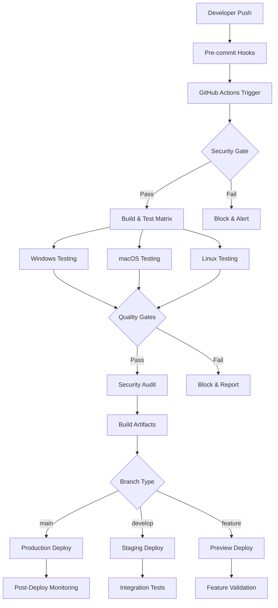
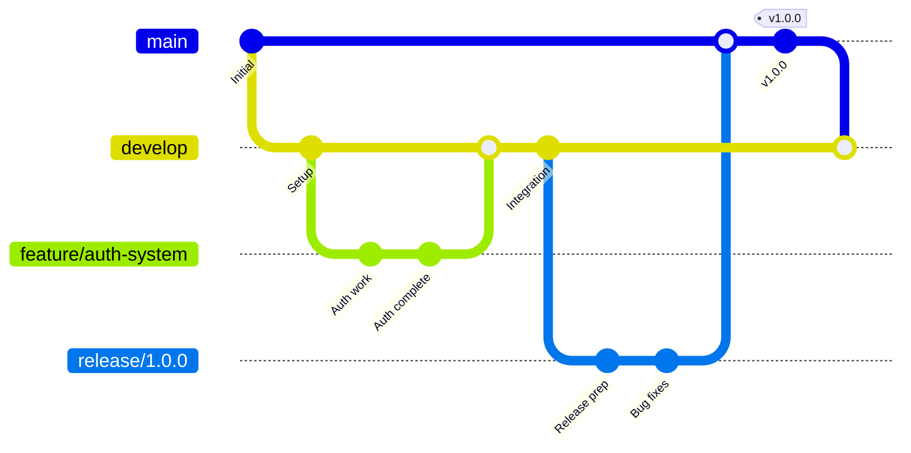

# CLAUDE CI/CD Plan: Secure Development Pipeline

**Document Version:** 1.0  
**Date:** 2025-01-27  
**Status:** Implementation Ready  
**Alignment:** CLAUDE-BUILD-PLAN.md v2.0 MVP  
**Security Classification:** Critical Infrastructure  
**Pipeline Type:** Security-First DevSecOps  

---

## Executive Summary

This document defines a **comprehensive, security-first CI/CD pipeline** for the Gemini CLI AI Developer Toolkit MVP. The pipeline emphasizes **automated security scanning, multi-platform testing, and zero-downtime deployment** while maintaining rapid development velocity.

### Pipeline Objectives

1. **Security-First**: Every commit is security-scanned before merge
2. **Multi-Platform**: Automated testing on Windows, macOS, and Linux
3. **Quality Gates**: No compromises on code quality, test coverage, or security
4. **Fast Feedback**: Developers get results within 5 minutes
5. **Production Ready**: Automated deployment with rollback capabilities

---

## 🏗️ Pipeline Architecture Overview



---

## 🔒 Security-First Pipeline Stages

### Stage 1: Pre-Commit Security Hooks

**Purpose**: Prevent secrets and security issues from entering the repository

```bash
#!/bin/bash
# .husky/pre-commit - Git pre-commit hook

set -e

echo "🔒 Running pre-commit security checks..."

# 1. Secret Detection
echo "🔍 Scanning for secrets..."
if command -v gitleaks &> /dev/null; then
    gitleaks detect --verbose --no-git
fi

# 2. Lint Security Issues
echo "🛡️ Security linting..."
npm run lint:security

# 3. Dependency Audit
echo "📦 Dependency security audit..."
npm audit --audit-level moderate

# 4. File Permission Check
echo "🔐 Checking file permissions..."
find . -name "*.key" -o -name "*.pem" -o -name "*credentials*" | while read -r file; do
    if [ -f "$file" ]; then
        echo "⚠️ WARNING: Potential secret file detected: $file"
        exit 1
    fi
done

echo "✅ Pre-commit security checks passed!"
```

### Stage 2: Automated Security Scanning

**GitHub Action**: `.github/workflows/security.yml`

```yaml
name: 🔒 Security Scanning

on:
  push:
    branches: [ main, develop ]
  pull_request:
    branches: [ main, develop ]
  schedule:
    # Run security scan daily at 2 AM UTC
    - cron: '0 2 * * *'

jobs:
  security-scan:
    name: Security Analysis
    runs-on: ubuntu-latest
    permissions:
      security-events: write
      actions: read
      contents: read

    steps:
    - name: Checkout Code
      uses: actions/checkout@v4
      with:
        fetch-depth: 0

    - name: Setup Node.js
      uses: actions/setup-node@v4
      with:
        node-version: '20'
        cache: 'npm'

    - name: Install Dependencies
      run: npm ci

    # Secret Detection
    - name: 🔍 GitLeaks Secret Scan
      uses: gitleaks/gitleaks-action@v2
      env:
        GITHUB_TOKEN: ${{ secrets.GITHUB_TOKEN }}
        GITLEAKS_LICENSE: ${{ secrets.GITLEAKS_LICENSE }}

    # Dependency Vulnerability Scanning
    - name: 📦 NPM Security Audit
      run: |
        npm audit --audit-level moderate
        npm audit --json > security-audit.json

    # Static Application Security Testing (SAST)
    - name: 🛡️ CodeQL Analysis
      uses: github/codeql-action/init@v3
      with:
        languages: javascript
        queries: security-extended

    - name: Autobuild
      uses: github/codeql-action/autobuild@v3

    - name: Perform CodeQL Analysis
      uses: github/codeql-action/analyze@v3

    # Container Security Scanning
    - name: 🐳 Build Docker Image
      run: docker build -t gemini-cli-toolkit:test .

    - name: 🔒 Container Security Scan
      uses: aquasecurity/trivy-action@master
      with:
        image-ref: 'gemini-cli-toolkit:test'
        format: 'sarif'
        output: 'trivy-results.sarif'

    # Custom Security Tests
    - name: 🧪 Custom Security Tests
      run: |
        npm run test:security
        npm run test:penetration

    # Security Report Generation
    - name: 📊 Generate Security Report
      run: |
        echo "# Security Scan Results" > security-report.md
        echo "Date: $(date)" >> security-report.md
        echo "" >> security-report.md
        echo "## Dependency Audit" >> security-report.md
        cat security-audit.json | jq '.vulnerabilities | length' >> security-report.md
        
    - name: Upload Security Results
      uses: github/codeql-action/upload-sarif@v3
      if: always()
      with:
        sarif_file: trivy-results.sarif

    # Security Gate - Fail if critical issues found
    - name: 🚨 Security Gate
      run: |
        CRITICAL_VULNS=$(cat security-audit.json | jq '.metadata.vulnerabilities.critical // 0')
        HIGH_VULNS=$(cat security-audit.json | jq '.metadata.vulnerabilities.high // 0')
        
        if [ "$CRITICAL_VULNS" -gt 0 ] || [ "$HIGH_VULNS" -gt 5 ]; then
          echo "🚨 Security gate failed: Critical=$CRITICAL_VULNS, High=$HIGH_VULNS vulnerabilities found"
          exit 1
        fi
        
        echo "✅ Security gate passed: No critical security issues found"
```

### Stage 3: Multi-Platform Build & Test Matrix

**GitHub Action**: `.github/workflows/ci.yml`

```yaml
name: 🏗️ CI/CD Pipeline

on:
  push:
    branches: [ main, develop, 'feature/*' ]
  pull_request:
    branches: [ main, develop ]

env:
  NODE_VERSION: '20'
  
jobs:
  # Security check must pass before build
  security-gate:
    name: 🔒 Security Gate
    uses: ./.github/workflows/security.yml

  # Multi-platform build and test matrix
  test-matrix:
    name: 🧪 Test (${{ matrix.os }})
    needs: security-gate
    runs-on: ${{ matrix.os }}
    
    strategy:
      fail-fast: false
      matrix:
        os: [ubuntu-latest, windows-latest, macos-latest]
        node-version: ['18', '20']
        exclude:
          # Reduce matrix size - test Node 18 only on Ubuntu
          - os: windows-latest
            node-version: '18'
          - os: macos-latest
            node-version: '18'

    steps:
    - name: Checkout Repository
      uses: actions/checkout@v4

    - name: Setup Node.js ${{ matrix.node-version }}
      uses: actions/setup-node@v4
      with:
        node-version: ${{ matrix.node-version }}
        cache: 'npm'

    - name: Install Dependencies
      run: npm ci

    - name: 🔍 Code Quality Check
      run: |
        npm run lint
        npm run type-check

    - name: 🧪 Unit Tests
      run: npm run test:unit -- --coverage --ci

    - name: 🔗 Integration Tests  
      run: npm run test:integration

    - name: 🚀 End-to-End Tests
      run: npm run test:e2e

    - name: 📊 Upload Coverage
      uses: codecov/codecov-action@v3
      with:
        file: ./coverage/lcov.info
        flags: ${{ matrix.os }}
        
    - name: 🏗️ Build Application
      run: npm run build

    - name: 📦 Package Test
      run: |
        npm pack --dry-run
        
    # Platform-specific tests
    - name: 🖥️ Platform-Specific Tests (Windows)
      if: matrix.os == 'windows-latest'
      run: |
        # Test PowerShell integration
        powershell -Command "npm run test:windows"
        
    - name: 🍎 Platform-Specific Tests (macOS)
      if: matrix.os == 'macos-latest'
      run: |
        # Test macOS Keychain integration
        npm run test:macos
        
    - name: 🐧 Platform-Specific Tests (Linux)
      if: matrix.os == 'ubuntu-latest'
      run: |
        # Test Linux Secret Service integration
        npm run test:linux

  # Quality gates that must pass before merge
  quality-gate:
    name: 🚦 Quality Gate
    needs: test-matrix
    runs-on: ubuntu-latest
    
    steps:
    - name: Checkout Repository
      uses: actions/checkout@v4
      
    - name: Setup Node.js
      uses: actions/setup-node@v4
      with:
        node-version: '20'
        cache: 'npm'
        
    - name: Install Dependencies
      run: npm ci
      
    - name: 📊 Check Coverage Threshold
      run: |
        COVERAGE=$(npm run test:coverage -- --silent | grep "All files" | awk '{print $10}' | sed 's/%//')
        if [ "$COVERAGE" -lt 90 ]; then
          echo "❌ Coverage gate failed: $COVERAGE% < 90%"
          exit 1
        fi
        echo "✅ Coverage gate passed: $COVERAGE%"
        
    - name: 🔍 Code Quality Score
      run: |
        # Check ESLint score
        ESLINT_ISSUES=$(npm run lint:count 2>/dev/null || echo "0")
        if [ "$ESLINT_ISSUES" -gt 5 ]; then
          echo "❌ Code quality gate failed: $ESLINT_ISSUES ESLint issues"
          exit 1
        fi
        echo "✅ Code quality gate passed: $ESLINT_ISSUES issues"

    - name: 🔒 Final Security Check
      run: |
        npm audit --audit-level high
        echo "✅ Final security check passed"

  # Build production artifacts
  build-artifacts:
    name: 📦 Build Production Artifacts
    needs: quality-gate
    runs-on: ubuntu-latest
    if: github.ref == 'refs/heads/main' || github.ref == 'refs/heads/develop'
    
    steps:
    - name: Checkout Repository
      uses: actions/checkout@v4
      
    - name: Setup Node.js
      uses: actions/setup-node@v4
      with:
        node-version: '20'
        cache: 'npm'
        
    - name: Install Dependencies
      run: npm ci
      
    - name: 🏗️ Build Production
      run: |
        npm run build:prod
        npm run build:docs
        
    - name: 📦 Create Distribution Package
      run: |
        npm pack
        
    - name: 🐳 Build Docker Images
      run: |
        docker build -t gemini-cli-toolkit:${{ github.sha }} .
        docker build -t gemini-cli-toolkit:latest .
        
    - name: 📤 Upload Artifacts
      uses: actions/upload-artifact@v4
      with:
        name: distribution-${{ github.sha }}
        path: |
          *.tgz
          dist/
          docs/
        retention-days: 30

  # Deploy to different environments based on branch
  deploy:
    name: 🚀 Deploy
    needs: build-artifacts
    runs-on: ubuntu-latest
    if: github.ref == 'refs/heads/main' || github.ref == 'refs/heads/develop'
    
    environment: 
      name: ${{ github.ref == 'refs/heads/main' && 'production' || 'staging' }}
      
    steps:
    - name: Download Artifacts
      uses: actions/download-artifact@v4
      with:
        name: distribution-${{ github.sha }}
        
    - name: 🚀 Deploy to NPM (Production)
      if: github.ref == 'refs/heads/main'
      run: |
        echo "//registry.npmjs.org/:_authToken=${{ secrets.NPM_TOKEN }}" > .npmrc
        npm publish --access public
        
    - name: 🧪 Deploy to NPM Beta (Staging)
      if: github.ref == 'refs/heads/develop'
      run: |
        echo "//registry.npmjs.org/:_authToken=${{ secrets.NPM_TOKEN }}" > .npmrc
        npm publish --tag beta --access public
        
    - name: 🐳 Deploy Docker Images
      run: |
        echo ${{ secrets.DOCKER_PASSWORD }} | docker login -u ${{ secrets.DOCKER_USERNAME }} --password-stdin
        docker push gemini-cli-toolkit:${{ github.sha }}
        if [ "${{ github.ref }}" == "refs/heads/main" ]; then
          docker push gemini-cli-toolkit:latest
        fi
```

### Stage 4: Deployment & Monitoring

**GitHub Action**: `.github/workflows/deploy.yml`

```yaml
name: 🚀 Production Deployment

on:
  workflow_run:
    workflows: ["🏗️ CI/CD Pipeline"]
    branches: [main]
    types: [completed]

jobs:
  deploy-production:
    name: 📦 Production Release
    runs-on: ubuntu-latest
    if: ${{ github.event.workflow_run.conclusion == 'success' }}
    
    environment:
      name: production
      url: https://www.npmjs.com/package/gemini-cli-toolkit
      
    steps:
    - name: Create GitHub Release
      uses: actions/create-release@v1
      env:
        GITHUB_TOKEN: ${{ secrets.GITHUB_TOKEN }}
      with:
        tag_name: v${{ github.run_number }}
        release_name: Release v${{ github.run_number }}
        draft: false
        prerelease: false
        
    - name: 📊 Post-Deploy Monitoring Setup
      run: |
        # Set up monitoring alerts
        curl -X POST "${{ secrets.MONITORING_WEBHOOK }}" \
          -H "Content-Type: application/json" \
          -d '{"text": "🚀 Gemini CLI Toolkit v${{ github.run_number }} deployed to production"}'
        
    - name: 🔍 Post-Deploy Security Scan
      run: |
        # Scan the deployed package
        npx audit-ci --config audit-ci.json
        
    - name: 📈 Update Metrics Dashboard
      run: |
        echo "Deployment completed at $(date)" >> deployment-metrics.log
```

---

## 🧪 Testing Strategy Integration

### Test Categories & Coverage Requirements

```json
{
  "test_requirements": {
    "unit_tests": {
      "coverage_threshold": 95,
      "files": "src/**/*.ts",
      "exclude": ["src/**/*.test.ts", "src/**/*.spec.ts"]
    },
    "integration_tests": {
      "coverage_threshold": 85,
      "focus": ["api_integration", "command_integration", "platform_integration"]
    },
    "security_tests": {
      "coverage_threshold": 100,
      "mandatory": ["input_validation", "authentication", "authorization", "audit_logging"]
    },
    "e2e_tests": {
      "platforms": ["windows", "macos", "linux"],
      "scenarios": ["command_execution", "error_handling", "configuration_management"]
    }
  }
}
```

### Security Testing Pipeline

```bash
#!/bin/bash
# scripts/security-test.sh - Comprehensive security testing

set -e

echo "🔒 Running comprehensive security tests..."

# 1. Static Application Security Testing (SAST)
echo "🔍 Static security analysis..."
npm run lint:security
npx semgrep --config=auto src/

# 2. Dependency Vulnerability Testing  
echo "📦 Dependency security testing..."
npm audit --audit-level moderate
npx audit-ci --config audit-ci.json

# 3. Secret Detection
echo "🕵️ Secret detection scan..."
npx gitleaks detect --verbose --no-git

# 4. Input Validation Testing
echo "🛡️ Input validation testing..."
npm run test:security -- --testPathPattern="input-validation"

# 5. Authentication Security Testing
echo "🔐 Authentication security testing..."
npm run test:security -- --testPathPattern="authentication"

# 6. Permission Testing
echo "👮 Permission and authorization testing..."
npm run test:security -- --testPathPattern="authorization"

# 7. Penetration Testing
echo "⚔️ Automated penetration testing..."
npm run test:penetration

# 8. Security Integration Tests
echo "🔗 Security integration testing..."
npm run test:security-integration

echo "✅ All security tests passed!"
```

---

## 🔄 Branching Strategy & Versioning

### Git Flow Integration



### Branch Protection Rules

```yaml
# Branch protection configuration
protection_rules:
  main:
    required_status_checks:
      strict: true
      contexts:
        - "🔒 Security Gate"
        - "🧪 Test (ubuntu-latest)"
        - "🧪 Test (windows-latest)" 
        - "🧪 Test (macos-latest)"
        - "🚦 Quality Gate"
    enforce_admins: true
    required_pull_request_reviews:
      required_approving_review_count: 2
      dismiss_stale_reviews: true
      require_code_owner_reviews: true
    restrictions:
      users: []
      teams: ["core-maintainers"]
      
  develop:
    required_status_checks:
      strict: true
      contexts:
        - "🔒 Security Gate"
        - "🧪 Test (ubuntu-latest)"
    required_pull_request_reviews:
      required_approving_review_count: 1
```

### Semantic Versioning Automation

```yaml
# .github/workflows/release.yml
name: 📋 Automated Release

on:
  push:
    branches: [main]

jobs:
  release:
    name: 🚀 Create Release
    runs-on: ubuntu-latest
    
    steps:
    - name: Checkout
      uses: actions/checkout@v4
      with:
        fetch-depth: 0
        token: ${{ secrets.GITHUB_TOKEN }}
        
    - name: Setup Node.js
      uses: actions/setup-node@v4
      with:
        node-version: '20'
        
    - name: Install Dependencies
      run: npm ci
      
    - name: 📋 Generate Release Notes
      uses: conventional-changelog-action@v3
      with:
        github-token: ${{ secrets.GITHUB_TOKEN }}
        release-count: 0
        version-file: 'package.json'
        
    - name: 🏷️ Create Git Tag
      run: |
        VERSION=$(node -p "require('./package.json').version")
        git tag "v$VERSION"
        git push origin "v$VERSION"
        
    - name: 📦 Publish to NPM
      run: |
        echo "//registry.npmjs.org/:_authToken=${{ secrets.NPM_TOKEN }}" > .npmrc
        npm publish --access public
```

---

## 🖥️ Development Environment Setup

### DevContainer Configuration

```json
{
  "name": "Gemini CLI Toolkit Dev Environment",
  "dockerFile": "Dockerfile",
  
  "features": {
    "ghcr.io/devcontainers/features/node:1": {
      "nodeGypDependencies": true,
      "version": "20"
    },
    "ghcr.io/devcontainers/features/github-cli:1": {},
    "ghcr.io/devcontainers/features/docker-in-docker:2": {}
  },
  
  "customizations": {
    "vscode": {
      "extensions": [
        "ms-vscode.vscode-typescript-next",
        "esbenp.prettier-vscode",
        "dbaeumer.vscode-eslint",
        "ms-vscode.test-adapter-converter",
        "github.vscode-github-actions",
        "ms-vscode.security-scan"
      ],
      "settings": {
        "typescript.preferences.noSemicolons": "off",
        "editor.formatOnSave": true,
        "editor.codeActionsOnSave": {
          "source.fixAll.eslint": true
        }
      }
    }
  },
  
  "postCreateCommand": "npm install && npm run setup:dev",
  "remoteUser": "node",
  
  "mounts": [
    "source=${localEnv:HOME}/.gitconfig,target=/home/node/.gitconfig,type=bind,consistency=cached"
  ],
  
  "secrets": {
    "GEMINI_API_KEY": {
      "description": "Gemini API key for development testing"
    }
  }
}
```

### Docker Development Environment

```dockerfile
# Dockerfile.dev - Development environment
FROM node:20-alpine

# Install development tools
RUN apk add --no-cache \
    git \
    bash \
    curl \
    docker-cli \
    && npm install -g \
    npm@latest \
    @types/node \
    typescript \
    ts-node \
    nodemon

# Security scanning tools
RUN npm install -g \
    audit-ci \
    gitleaks \
    semgrep

# Create app directory with proper permissions
WORKDIR /app
RUN addgroup -g 1001 -S nodejs && \
    adduser -S nodejs -u 1001 && \
    chown -R nodejs:nodejs /app

# Copy package files
COPY package*.json ./
RUN npm ci

# Copy source code
COPY . .
RUN chown -R nodejs:nodejs /app

# Switch to non-root user
USER nodejs

# Development server
EXPOSE 3000 9229
CMD ["npm", "run", "dev"]
```

---

## 📊 Monitoring & Observability

### Performance Monitoring

```yaml
# .github/workflows/performance.yml
name: 📈 Performance Monitoring

on:
  push:
    branches: [main, develop]
  schedule:
    - cron: '0 */6 * * *'  # Every 6 hours

jobs:
  performance-test:
    name: 🚀 Performance Benchmarks
    runs-on: ubuntu-latest
    
    steps:
    - name: Checkout
      uses: actions/checkout@v4
      
    - name: Setup Node.js
      uses: actions/setup-node@v4
      with:
        node-version: '20'
        
    - name: Install Dependencies
      run: npm ci
      
    - name: 🏗️ Build Application
      run: npm run build
      
    - name: 📊 Run Performance Tests
      run: |
        npm run test:performance -- --json > performance-results.json
        
    - name: 📈 Performance Regression Check
      run: |
        node scripts/check-performance-regression.js
        
    - name: 📋 Generate Performance Report
      run: |
        node scripts/generate-performance-report.js > performance-report.md
        
    - name: 📤 Upload Performance Results
      uses: actions/upload-artifact@v4
      with:
        name: performance-results-${{ github.sha }}
        path: |
          performance-results.json
          performance-report.md
```

### Security Monitoring & Alerting

```javascript
// scripts/security-monitor.js - Security monitoring setup
const { WebClient } = require('@slack/web-api');

class SecurityMonitor {
  constructor() {
    this.slack = new WebClient(process.env.SLACK_TOKEN);
  }
  
  async checkSecurityAlerts() {
    const alerts = await this.scanForSecurityIssues();
    
    if (alerts.critical.length > 0) {
      await this.notifySecurityTeam(alerts.critical, 'CRITICAL');
    }
    
    if (alerts.high.length > 0) {
      await this.notifySecurityTeam(alerts.high, 'HIGH');
    }
    
    await this.updateSecurityDashboard(alerts);
  }
  
  async notifySecurityTeam(alerts, severity) {
    const message = {
      channel: '#security-alerts',
      text: `🚨 ${severity} Security Alert`,
      blocks: [
        {
          type: 'section',
          text: {
            type: 'mrkdwn',
            text: `*${severity} Security Issues Detected*\n${alerts.length} issues found in Gemini CLI Toolkit`
          }
        },
        {
          type: 'section',
          fields: alerts.map(alert => ({
            type: 'mrkdwn',
            text: `*${alert.type}*\n${alert.description}`
          }))
        }
      ]
    };
    
    await this.slack.chat.postMessage(message);
  }
}
```

---

## 📋 Quality Gates & Success Criteria

### Pre-merge Quality Gates

```yaml
quality_gates:
  security:
    critical_vulnerabilities: 0
    high_vulnerabilities: 0
    secrets_detected: 0
    
  code_quality:
    test_coverage: ">= 90%"
    eslint_issues: "<= 5"
    typescript_errors: 0
    
  performance:
    build_time: "<= 2 minutes"
    bundle_size: "<= 50MB"
    startup_time: "<= 3 seconds"
    
  compatibility:
    node_versions: ["18", "20"]
    platforms: ["windows", "macos", "linux"]
    success_rate: ">= 95%"
```

### Production Deployment Criteria

```bash
#!/bin/bash
# scripts/production-gate.sh - Production deployment gate

set -e

echo "🚦 Checking production deployment criteria..."

# 1. Security Gate
echo "🔒 Security validation..."
CRITICAL_VULNS=$(npm audit --audit-level critical --json | jq '.metadata.vulnerabilities.critical // 0')
if [ "$CRITICAL_VULNS" -gt 0 ]; then
  echo "❌ BLOCKED: $CRITICAL_VULNS critical vulnerabilities found"
  exit 1
fi

# 2. Quality Gate
echo "📊 Quality validation..."
COVERAGE=$(npm run test:coverage -- --silent | grep "All files" | awk '{print $10}' | sed 's/%//')
if [ "$COVERAGE" -lt 90 ]; then
  echo "❌ BLOCKED: Test coverage $COVERAGE% < 90%"
  exit 1
fi

# 3. Performance Gate
echo "⚡ Performance validation..."
npm run test:performance
PERF_SCORE=$(cat performance-results.json | jq '.overall_score')
if (( $(echo "$PERF_SCORE < 80" | bc -l) )); then
  echo "❌ BLOCKED: Performance score $PERF_SCORE < 80"
  exit 1
fi

# 4. Integration Gate
echo "🔗 Integration validation..."
npm run test:integration:production

echo "✅ All production gates passed - ready for deployment!"
```

---

## 🎯 Success Metrics & KPIs

### CI/CD Pipeline Metrics

| Metric | Target | Critical Threshold | Notes |
|--------|--------|--------------------|-------|
| **Build Success Rate** | > 95% | < 90% | Across all platforms |
| **Security Scan Speed** | < 5 min | > 10 min | Full security pipeline |
| **Deploy Frequency** | Daily | < Weekly | Main branch deployments |
| **Lead Time** | < 2 hours | > 8 hours | Commit to production |
| **Mean Time to Recovery** | < 30 min | > 2 hours | Production incident response |

### Security Metrics

| Metric | Target | Critical Threshold | Action Required |
|--------|--------|--------------------|-----------------|
| **Critical Vulnerabilities** | 0 | > 0 | Block deployment |
| **High Vulnerabilities** | < 3 | > 10 | Security review |
| **Secret Detection Rate** | 100% | < 95% | Improve scanning |
| **Security Test Coverage** | 100% | < 95% | Add security tests |
| **Compliance Score** | > 95% | < 90% | Audit required |

### Development Velocity

| Metric | Target | Threshold | Impact |
|--------|--------|-----------|--------|
| **Developer Satisfaction** | > 4.5/5 | < 4.0/5 | Process improvement |
| **PR Cycle Time** | < 24 hours | > 72 hours | Review bottleneck |
| **Failed Build Recovery** | < 15 min | > 60 min | Pipeline optimization |
| **Test Execution Time** | < 10 min | > 20 min | Test optimization |

---

## 🚀 Implementation Timeline

### Week 1: Foundation Setup
- ✅ Repository structure and basic CI setup
- ✅ Security scanning tools integration
- ✅ Multi-platform test matrix configuration
- ✅ Development environment (DevContainer) setup

### Week 2: Security Pipeline
- ✅ Pre-commit hooks and secret detection
- ✅ SAST/DAST integration
- ✅ Dependency vulnerability scanning
- ✅ Security quality gates

### Week 3: Quality & Testing
- ✅ Test automation across platforms
- ✅ Code coverage and quality gates  
- ✅ Performance benchmarking
- ✅ Integration test suite

### Week 4: Deployment & Monitoring
- ✅ Automated NPM publishing
- ✅ Docker container builds
- ✅ Production monitoring setup
- ✅ Incident response procedures

### Week 5-6: Optimization & Documentation
- ✅ Pipeline performance optimization
- ✅ Complete documentation
- ✅ Team training and handover
- ✅ Production readiness validation

---

## 🎯 Conclusion

This **security-first CI/CD pipeline** provides a robust, automated foundation for developing and deploying the Gemini CLI AI Developer Toolkit. By emphasizing security at every stage while maintaining rapid development velocity, the pipeline ensures both developer productivity and production reliability.

**Key Success Factors:**
1. **Security-First Design**: No compromises on security for speed
2. **Multi-Platform Excellence**: Consistent quality across all supported platforms  
3. **Quality Automation**: Comprehensive testing and quality gates
4. **Fast Feedback Loops**: Developers get results within minutes
5. **Production Readiness**: Enterprise-grade deployment and monitoring

**Next Steps:**
1. 🏗️ Implement pipeline infrastructure in GitHub Actions
2. 🔒 Configure security scanning tools and credentials
3. 📊 Set up monitoring dashboards and alerting
4. 👥 Train development team on pipeline workflows
5. 🚀 Begin MVP development with pipeline in place

*The foundation for secure, reliable AI development starts with an uncompromising CI/CD pipeline.*