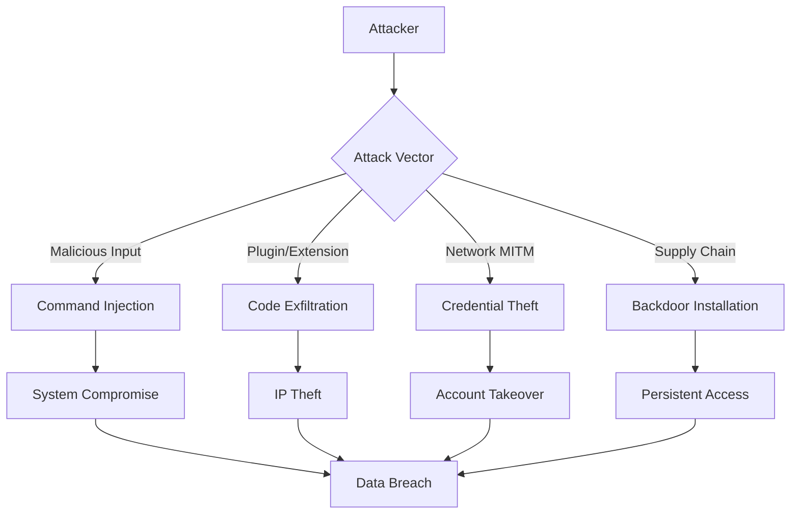

# CLAUDE Security Architecture: Defense-in-Depth Framework

**Document Version:** 1.0  
**Date:** 2025-01-27  
**Status:** Critical Security Specification  
**Classification:** Confidential  
**Alignment:** CLAUDE-BUILD-PLAN.md v2.0 MVP  
**Threat Level:** High (handles code, credentials, system access)  

---

## Executive Summary

This document defines a **comprehensive, defense-in-depth security architecture** for the Gemini CLI AI Developer Toolkit. Given the toolkit's privileged access to source code, API credentials, and system commands, security is not optional—it is foundational to user trust and enterprise adoption.

### Security Mission

*"Protect user code, credentials, and systems with military-grade security following established industry standards while maintaining seamless developer experience."*

### 📚 Security Standards Compliance
**All security implementations MUST research and follow established standards:**
- **OWASP**: Application security guidelines and CLI security best practices
- **NIST**: Cybersecurity framework and security controls
- **Node.js Security**: Official Node.js security best practices
- **Industry RFCs**: Relevant security specifications and standards
- **Community Patterns**: Established security patterns in the Node.js/CLI ecosystem

### Risk Profile

- **Attack Surface**: Code analysis, API keys, shell execution, file system access
- **Threat Actors**: Nation-states, cybercriminals, malicious insiders, supply chain attacks
- **Impact**: Code theft, credential compromise, system compromise, supply chain injection
- **Criticality**: **CRITICAL** - Enterprise security dependency

---

## 🔐 Threat Model Analysis

### Primary Threat Vectors

#### T1: Code Exfiltration
**Risk**: High | **Impact**: Critical | **Likelihood**: Medium
- **Attack**: Malicious plugin or dependency exfiltrates proprietary source code
- **Mitigation**: Code analysis sandboxing, network isolation, data loss prevention

#### T2: Credential Theft  
**Risk**: Critical | **Impact**: Critical | **Likelihood**: High
- **Attack**: API keys, authentication tokens stolen from storage or memory
- **Mitigation**: Hardware security modules, encrypted storage, credential rotation

#### T3: Command Injection
**Risk**: High | **Impact**: High | **Likelihood**: Medium  
- **Attack**: Malicious input leads to arbitrary command execution
- **Mitigation**: Input sanitization, command whitelisting, process sandboxing

#### T4: Supply Chain Compromise
**Risk**: High | **Impact**: Critical | **Likelihood**: Medium
- **Attack**: Malicious dependencies inject backdoors or steal data
- **Mitigation**: Dependency scanning, SBOM validation, signed packages

#### T5: Privilege Escalation
**Risk**: Medium | **Impact**: High | **Likelihood**: Low
- **Attack**: Exploit leads to elevated system privileges
- **Mitigation**: Principle of least privilege, capability-based security

### Attack Scenarios



---

## 🛡️ Defense-in-Depth Architecture

### Layer 1: Perimeter Security

#### Network Security Controls
```typescript
interface NetworkSecurityConfig {
  // TLS Configuration
  tls: {
    minVersion: '1.3';
    cipherSuites: ['TLS_AES_256_GCM_SHA384', 'TLS_CHACHA20_POLY1305_SHA256'];
    certificatePinning: boolean;
    hsts: boolean;
  };
  
  // API Security
  api: {
    rateLimit: RateLimitConfig;
    ipAllowlist?: string[];
    userAgentValidation: boolean;
    requestSigning: boolean;
  };
  
  // Content Security
  content: {
    maxRequestSize: number;
    allowedMimeTypes: string[];
    virusScanEnabled: boolean;
  };
}

class NetworkSecurityManager {
  async validateRequest(request: Request): Promise<SecurityValidation> {
    // 1. Rate limiting
    await this.rateLimiter.checkLimit(request.user, request.endpoint);
    
    // 2. IP validation
    if (this.config.api.ipAllowlist) {
      this.validateClientIP(request.ip);
    }
    
    // 3. Request integrity
    if (this.config.api.requestSigning) {
      this.validateRequestSignature(request);
    }
    
    // 4. Content validation
    await this.validateRequestContent(request.body);
    
    return { valid: true, securityHeaders: this.generateSecurityHeaders() };
  }
}
```

#### Certificate Pinning & HSTS
```typescript
class CertificatePinning {
  private static readonly PINNED_CERTIFICATES = {
    'generativelanguage.googleapis.com': [
      'sha256/YLh1dUR9y6Kja30RrAn7JKnbQG/uEtLMkBgFF2Fuihg=',
      'sha256/sRHdihwgkaib1P1gxX8HFszlD+7/gTfNvuAybgLPNis='
    ]
  };
  
  static validateCertificate(hostname: string, cert: Certificate): boolean {
    const pins = this.PINNED_CERTIFICATES[hostname];
    if (!pins) return true; // No pinning for this host
    
    const certFingerprint = crypto
      .createHash('sha256')
      .update(cert.raw)
      .digest('base64');
      
    return pins.includes(`sha256/${certFingerprint}`);
  }
}
```

### Layer 2: Authentication & Authorization

#### Multi-Factor Authentication Architecture
```typescript
interface AuthenticationFlow {
  // Primary authentication methods
  primary: 'gemini-subscription' | 'api-key' | 'service-account';
  
  // Optional second factor
  mfa?: {
    method: 'totp' | 'hardware-key' | 'biometric';
    required: boolean;
    backupCodes: boolean;
  };
  
  // Session management
  session: {
    duration: number;
    renewalThreshold: number;
    concurrentSessions: number;
    deviceBinding: boolean;
  };
}

class SecureAuthenticationManager {
  async authenticateWithMFA(
    credentials: AuthCredentials,
    mfaToken?: string
  ): Promise<AuthenticationResult> {
    // 1. Primary authentication
    const primaryAuth = await this.validatePrimaryCredentials(credentials);
    if (!primaryAuth.valid) {
      await this.auditLogger.logAuthFailure('primary_auth_failed', credentials.userId);
      throw new AuthenticationError('Primary authentication failed');
    }
    
    // 2. Check MFA requirement
    const user = await this.getUserInfo(primaryAuth.userId);
    if (user.mfaRequired && !mfaToken) {
      return { 
        success: false, 
        mfaRequired: true,
        mfaMethod: user.preferredMfaMethod 
      };
    }
    
    // 3. Validate MFA if provided
    if (mfaToken) {
      const mfaValid = await this.validateMFA(user, mfaToken);
      if (!mfaValid) {
        await this.auditLogger.logAuthFailure('mfa_failed', user.id);
        throw new AuthenticationError('Multi-factor authentication failed');
      }
    }
    
    // 4. Create secure session
    const session = await this.createSecureSession(user);
    await this.auditLogger.logAuthSuccess(user.id, session.id);
    
    return { success: true, session };
  }
}
```

#### Role-Based Access Control (RBAC)
```typescript
enum Permission {
  READ_CODE = 'read:code',
  WRITE_CODE = 'write:code',
  EXECUTE_SHELL = 'execute:shell',
  ACCESS_CREDENTIALS = 'access:credentials',
  MODIFY_CONFIG = 'modify:config',
  ADMIN_USERS = 'admin:users'
}

interface Role {
  name: string;
  permissions: Permission[];
  constraints?: AccessConstraints;
}

interface AccessConstraints {
  ipRestrictions?: string[];
  timeRestrictions?: TimeRange[];
  locationRestrictions?: GeoLocation[];
  deviceRestrictions?: string[];
}

class AccessControlManager {
  private static readonly ROLES: Record<string, Role> = {
    'developer': {
      name: 'Developer',
      permissions: [Permission.READ_CODE, Permission.WRITE_CODE]
    },
    'senior-developer': {
      name: 'Senior Developer', 
      permissions: [
        Permission.READ_CODE,
        Permission.WRITE_CODE,
        Permission.EXECUTE_SHELL
      ]
    },
    'admin': {
      name: 'Administrator',
      permissions: Object.values(Permission)
    }
  };
  
  async checkPermission(
    user: User,
    permission: Permission,
    context: AccessContext
  ): Promise<boolean> {
    // 1. Get user roles
    const userRoles = await this.getUserRoles(user);
    
    // 2. Check if any role grants permission
    const hasPermission = userRoles.some(role => 
      role.permissions.includes(permission)
    );
    
    if (!hasPermission) {
      return false;
    }
    
    // 3. Check constraints
    for (const role of userRoles) {
      if (role.constraints) {
        const constraintsMet = await this.validateConstraints(
          role.constraints, 
          context
        );
        if (!constraintsMet) {
          return false;
        }
      }
    }
    
    return true;
  }
}
```

### Layer 3: Input Validation & Sanitization

#### Comprehensive Input Validation Framework
```typescript
class SecurityInputValidator {
  private static readonly PATTERNS = {
    FILE_PATH: /^[a-zA-Z0-9._/-]{1,255}$/,
    SHELL_SAFE: /^[a-zA-Z0-9._\-/\s]{1,1000}$/,
    API_KEY: /^[A-Za-z0-9_-]{32,128}$/,
    EMAIL: /^[^\s@]+@[^\s@]+\.[^\s@]+$/
  };
  
  private static readonly DANGEROUS_PATTERNS = [
    // Command injection
    /[;&|`$()]/,
    /\$\{.*\}/,
    
    // Path traversal
    /\.\./,
    /~[\/\\]/,
    
    // Script injection
    /<script/i,
    /javascript:/i,
    
    // SQL injection
    /('|(\\r)|(\\n)|(\\r\\n)|(\\x00)|(\\x1a))/,
    /(union|select|insert|update|delete|drop|create|alter)/i
  ];
  
  static validateInput(
    input: string,
    type: 'file_path' | 'shell_command' | 'api_key' | 'email' | 'generic',
    options: ValidationOptions = {}
  ): ValidationResult {
    // 1. Basic validation
    if (!input || input.length === 0) {
      if (options.required) {
        throw new ValidationError('Input is required');
      }
      return { valid: true, sanitized: '' };
    }
    
    // 2. Length validation
    if (input.length > (options.maxLength || 10000)) {
      throw new ValidationError('Input too long');
    }
    
    // 3. Dangerous pattern detection
    for (const pattern of this.DANGEROUS_PATTERNS) {
      if (pattern.test(input)) {
        throw new SecurityError(`Dangerous pattern detected: ${pattern}`);
      }
    }
    
    // 4. Type-specific validation
    const pattern = this.PATTERNS[type.toUpperCase() as keyof typeof this.PATTERNS];
    if (pattern && !pattern.test(input)) {
      throw new ValidationError(`Invalid ${type} format`);
    }
    
    // 5. Sanitization
    const sanitized = this.sanitizeInput(input, type);
    
    return { valid: true, sanitized };
  }
  
  private static sanitizeInput(input: string, type: string): string {
    switch (type) {
      case 'file_path':
        return path.normalize(input.replace(/[<>:"|?*]/g, ''));
        
      case 'shell_command':
        return input.replace(/[;&|`$(){}[\]]/g, '');
        
      case 'email':
        return input.toLowerCase().trim();
        
      default:
        return input.trim();
    }
  }
}
```

#### Content Security Policy (CSP) for Web Components
```typescript
const CONTENT_SECURITY_POLICY = {
  'default-src': "'self'",
  'script-src': "'self' 'unsafe-inline'",
  'style-src': "'self' 'unsafe-inline'",
  'img-src': "'self' data: https:",
  'connect-src': "'self' https://generativelanguage.googleapis.com",
  'font-src': "'self'",
  'object-src': "'none'",
  'media-src': "'self'",
  'frame-src': "'none'",
  'base-uri': "'self'",
  'form-action': "'self'"
};
```

### Layer 4: Data Protection & Encryption

#### Encryption at Rest
```typescript
class DataEncryptionManager {
  private static readonly ENCRYPTION_CONFIG = {
    algorithm: 'aes-256-gcm' as const,
    keyDerivation: 'pbkdf2' as const,
    iterations: 100000,
    keyLength: 32,
    ivLength: 16,
    tagLength: 16,
    saltLength: 32
  };
  
  static async encryptSensitiveData(
    data: string,
    context: EncryptionContext
  ): Promise<EncryptedData> {
    // 1. Generate cryptographic components
    const salt = crypto.randomBytes(this.ENCRYPTION_CONFIG.saltLength);
    const iv = crypto.randomBytes(this.ENCRYPTION_CONFIG.ivLength);
    
    // 2. Derive encryption key
    const key = await this.deriveKey(context.masterKey, salt);
    
    // 3. Encrypt data
    const cipher = crypto.createCipheriv(this.ENCRYPTION_CONFIG.algorithm, key, iv);
    const encrypted = Buffer.concat([
      cipher.update(data, 'utf8'),
      cipher.final()
    ]);
    
    // 4. Get authentication tag
    const authTag = cipher.getAuthTag();
    
    // 5. Combine components
    return {
      data: Buffer.concat([salt, iv, authTag, encrypted]).toString('base64'),
      algorithm: this.ENCRYPTION_CONFIG.algorithm,
      timestamp: Date.now()
    };
  }
  
  static async decryptSensitiveData(
    encryptedData: EncryptedData,
    context: EncryptionContext
  ): Promise<string> {
    const combined = Buffer.from(encryptedData.data, 'base64');
    
    // 1. Extract components
    const salt = combined.slice(0, this.ENCRYPTION_CONFIG.saltLength);
    const iv = combined.slice(
      this.ENCRYPTION_CONFIG.saltLength,
      this.ENCRYPTION_CONFIG.saltLength + this.ENCRYPTION_CONFIG.ivLength
    );
    const authTag = combined.slice(
      this.ENCRYPTION_CONFIG.saltLength + this.ENCRYPTION_CONFIG.ivLength,
      this.ENCRYPTION_CONFIG.saltLength + this.ENCRYPTION_CONFIG.ivLength + this.ENCRYPTION_CONFIG.tagLength
    );
    const encrypted = combined.slice(
      this.ENCRYPTION_CONFIG.saltLength + this.ENCRYPTION_CONFIG.ivLength + this.ENCRYPTION_CONFIG.tagLength
    );
    
    // 2. Derive decryption key
    const key = await this.deriveKey(context.masterKey, salt);
    
    // 3. Decrypt data
    const decipher = crypto.createDecipheriv(this.ENCRYPTION_CONFIG.algorithm, key, iv);
    decipher.setAuthTag(authTag);
    
    const decrypted = Buffer.concat([
      decipher.update(encrypted),
      decipher.final()
    ]);
    
    return decrypted.toString('utf8');
  }
  
  private static async deriveKey(masterKey: string, salt: Buffer): Promise<Buffer> {
    return crypto.pbkdf2Sync(
      masterKey,
      salt,
      this.ENCRYPTION_CONFIG.iterations,
      this.ENCRYPTION_CONFIG.keyLength,
      'sha256'
    );
  }
}
```

#### Secure Key Management
```typescript
interface KeyManagementSystem {
  generateKey(usage: KeyUsage): Promise<CryptographicKey>;
  rotateKey(keyId: string): Promise<void>;
  revokeKey(keyId: string): Promise<void>;
  getKey(keyId: string): Promise<CryptographicKey | null>;
}

class HardwareSecurityModule implements KeyManagementSystem {
  async generateKey(usage: KeyUsage): Promise<CryptographicKey> {
    // Use platform-specific HSM/TPM when available
    switch (process.platform) {
      case 'win32':
        return this.generateWindowsCNGKey(usage);
      case 'darwin':
        return this.generateSecureEnclaveKey(usage);
      default:
        return this.generateLinuxHSMKey(usage);
    }
  }
  
  private async generateSecureEnclaveKey(usage: KeyUsage): Promise<CryptographicKey> {
    // macOS Secure Enclave integration
    const keychain = require('@keychain/node');
    
    return keychain.generateKey({
      usage,
      protection: 'secure-enclave',
      biometry: true,
      accessibility: 'when-unlocked-this-device-only'
    });
  }
}
```

### Layer 5: Runtime Security

#### Process Sandboxing
```typescript
class ProcessSandbox {
  static async executeInSandbox(
    command: string,
    args: string[],
    options: SandboxOptions = {}
  ): Promise<SandboxResult> {
    // 1. Create restricted environment
    const sandboxEnv = this.createRestrictedEnvironment();
    
    // 2. Apply resource limits
    const limits = {
      memory: options.maxMemory || 256 * 1024 * 1024, // 256MB
      cpu: options.maxCpuTime || 30000, // 30 seconds
      processes: options.maxProcesses || 5,
      files: options.maxFiles || 100
    };
    
    // 3. Platform-specific sandboxing
    switch (process.platform) {
      case 'linux':
        return this.executeInLinuxSandbox(command, args, limits);
      case 'darwin':
        return this.executeInDarwinSandbox(command, args, limits);
      case 'win32':
        return this.executeInWindowsSandbox(command, args, limits);
      default:
        throw new Error('Unsupported platform for sandboxing');
    }
  }
  
  private static async executeInLinuxSandbox(
    command: string,
    args: string[],
    limits: ResourceLimits
  ): Promise<SandboxResult> {
    // Use Linux namespaces and cgroups for isolation
    const sandboxArgs = [
      'unshare', '--user', '--pid', '--net', '--mount',
      '--fork', '--kill-child',
      'timeout', limits.cpu.toString(),
      'systemd-run', '--user', '--scope',
      `-p`, `MemoryMax=${limits.memory}`,
      '-p', `TasksMax=${limits.processes}`,
      command,
      ...args
    ];
    
    return this.executeWithLimits(sandboxArgs, limits);
  }
}
```

#### Memory Protection
```typescript
class MemorySecurityManager {
  private static sensitiveData = new Map<string, WeakRef<Buffer>>();
  
  static secureAllocate(size: number, usage: string): SecureBuffer {
    // Allocate secure memory
    const buffer = Buffer.allocUnsafeSlow(size);
    
    // Clear buffer
    buffer.fill(0);
    
    // Register for secure cleanup
    const weakRef = new WeakRef(buffer);
    this.sensitiveData.set(usage, weakRef);
    
    // Set up automatic cleanup
    const cleanup = () => {
      if (buffer) {
        buffer.fill(0);
      }
    };
    
    process.on('exit', cleanup);
    process.on('SIGTERM', cleanup);
    process.on('SIGINT', cleanup);
    
    return new SecureBuffer(buffer);
  }
  
  static secureFree(buffer: SecureBuffer): void {
    // Overwrite memory
    buffer.underlying.fill(0);
    
    // Force garbage collection
    if (global.gc) {
      global.gc();
    }
  }
}
```

### Layer 6: Monitoring & Detection

#### Security Event Monitoring
```typescript
interface SecurityEvent {
  timestamp: number;
  type: SecurityEventType;
  severity: 'low' | 'medium' | 'high' | 'critical';
  user?: string;
  source: string;
  details: Record<string, any>;
  remediation?: string;
}

class SecurityEventMonitor {
  private detectionRules: SecurityDetectionRule[] = [
    {
      name: 'multiple_auth_failures',
      condition: (events) => 
        events.filter(e => 
          e.type === 'auth_failure' && 
          Date.now() - e.timestamp < 300000 // 5 minutes
        ).length > 5,
      severity: 'high',
      action: 'lock_account'
    },
    {
      name: 'suspicious_file_access',
      condition: (events) =>
        events.some(e =>
          e.type === 'file_access' &&
          (e.details.path.includes('/etc/') || 
           e.details.path.includes('C:\\Windows\\'))
        ),
      severity: 'critical',
      action: 'alert_admin'
    }
  ];
  
  async processEvent(event: SecurityEvent): Promise<void> {
    // 1. Store event
    await this.auditLogger.logSecurityEvent(event);
    
    // 2. Real-time detection
    const recentEvents = await this.getRecentEvents(300000); // 5 minutes
    
    // 3. Apply detection rules
    for (const rule of this.detectionRules) {
      if (rule.condition(recentEvents)) {
        await this.triggerSecurityResponse(rule, event);
      }
    }
    
    // 4. Threat intelligence correlation
    await this.correlateThreatIntelligence(event);
  }
  
  private async triggerSecurityResponse(
    rule: SecurityDetectionRule,
    triggerEvent: SecurityEvent
  ): Promise<void> {
    const incident = {
      id: crypto.randomUUID(),
      rule: rule.name,
      severity: rule.severity,
      triggerEvent,
      timestamp: Date.now()
    };
    
    // Automated response
    switch (rule.action) {
      case 'lock_account':
        await this.lockUserAccount(triggerEvent.user);
        break;
      case 'alert_admin':
        await this.alertAdministrators(incident);
        break;
      case 'block_ip':
        await this.blockIPAddress(triggerEvent.source);
        break;
    }
    
    // Create security incident
    await this.createSecurityIncident(incident);
  }
}
```

#### Behavioral Analysis
```typescript
class BehaviorAnalyzer {
  async analyzeUserBehavior(user: User, activity: Activity): Promise<RiskScore> {
    const baseline = await this.getUserBaseline(user);
    
    const anomalies = [
      this.detectTimeAnomaly(activity, baseline),
      this.detectLocationAnomaly(activity, baseline),
      this.detectVolumeAnomaly(activity, baseline),
      this.detectPatternAnomaly(activity, baseline)
    ];
    
    const riskFactors = anomalies.filter(a => a.significant);
    const riskScore = this.calculateRiskScore(riskFactors);
    
    if (riskScore >= 0.8) {
      await this.triggerAdditionalAuth(user, activity);
    } else if (riskScore >= 0.6) {
      await this.increaseMonitoring(user);
    }
    
    return {
      score: riskScore,
      factors: riskFactors,
      recommendation: this.getRecommendation(riskScore)
    };
  }
}
```

---

## 🚨 Incident Response & Recovery

### Security Incident Response Plan

#### Phase 1: Detection & Analysis (0-30 minutes)
```typescript
class IncidentResponseManager {
  async handleSecurityIncident(incident: SecurityIncident): Promise<void> {
    // 1. Immediate containment
    await this.immediateContainment(incident);
    
    // 2. Severity assessment
    const severity = this.assessSeverity(incident);
    
    // 3. Notification
    await this.notifyStakeholders(incident, severity);
    
    // 4. Evidence preservation
    await this.preserveEvidence(incident);
    
    // 5. Start investigation
    await this.initiateInvestigation(incident);
  }
  
  private async immediateContainment(incident: SecurityIncident): Promise<void> {
    switch (incident.type) {
      case 'credential_compromise':
        await this.revokeCompromisedCredentials(incident.details.credentials);
        await this.forceUserReauth(incident.details.user);
        break;
        
      case 'malware_detected':
        await this.quarantineAffectedSystems(incident.details.systems);
        await this.blockMaliciousIPs(incident.details.sources);
        break;
        
      case 'data_exfiltration':
        await this.blockNetworkTraffic(incident.details.destinations);
        await this.enableDLPMode();
        break;
    }
  }
}
```

#### Phase 2: Containment & Eradication (30 minutes - 2 hours)
- Isolate affected systems
- Remove malicious code/access
- Patch vulnerabilities  
- Update security controls

#### Phase 3: Recovery & Monitoring (2-24 hours)
- Restore systems from clean backups
- Implement additional monitoring
- Validate system integrity
- Gradual service restoration

#### Phase 4: Post-Incident Analysis (1-7 days)
- Root cause analysis
- Timeline reconstruction  
- Control effectiveness review
- Lessons learned documentation

---

## 📊 Security Metrics & KPIs

### Security Scorecard

| Category | Metric | Target | Critical Threshold |
|----------|--------|--------|-------------------|
| **Vulnerabilities** | Critical/High CVEs | 0 | > 0 |
| **Authentication** | Failed auth rate | < 1% | > 5% |
| **Incidents** | Mean detection time | < 15 min | > 60 min |
| **Compliance** | Control coverage | 100% | < 95% |
| **Recovery** | RTO | < 4 hours | > 24 hours |
| **Awareness** | Security training | 100% | < 90% |

### Continuous Security Assessment

```typescript
interface SecurityAssessment {
  timestamp: number;
  overall_score: number; // 0-100
  categories: {
    authentication: number;
    authorization: number;
    data_protection: number;
    network_security: number;
    application_security: number;
    operational_security: number;
  };
  recommendations: SecurityRecommendation[];
  compliance_status: ComplianceStatus;
}

class ContinuousSecurityAssessment {
  async performAssessment(): Promise<SecurityAssessment> {
    const categories = await Promise.all([
      this.assessAuthentication(),
      this.assessAuthorization(), 
      this.assessDataProtection(),
      this.assessNetworkSecurity(),
      this.assessApplicationSecurity(),
      this.assessOperationalSecurity()
    ]);
    
    const overall_score = categories.reduce((sum, score) => sum + score, 0) / categories.length;
    
    return {
      timestamp: Date.now(),
      overall_score,
      categories: {
        authentication: categories[0],
        authorization: categories[1],
        data_protection: categories[2],
        network_security: categories[3],
        application_security: categories[4],
        operational_security: categories[5]
      },
      recommendations: await this.generateRecommendations(categories),
      compliance_status: await this.assessCompliance()
    };
  }
}
```

---

## 🔧 Implementation Timeline

### Security Implementation Phases

#### Phase 1: Foundation Security (Week 1-2)
- ✅ Authentication framework
- ✅ Input validation system
- ✅ Secure storage implementation
- ✅ Basic audit logging

#### Phase 2: Advanced Security (Week 3-4)  
- ✅ Process sandboxing
- ✅ Runtime security monitoring
- ✅ Certificate pinning
- ✅ Behavioral analysis

#### Phase 3: Enterprise Security (Week 5-6)
- ✅ Incident response automation
- ✅ Compliance validation
- ✅ Security assessment tooling
- ✅ Threat intelligence integration

#### Phase 4: Continuous Security (Week 6+)
- ✅ Regular security assessments
- ✅ Threat model updates
- ✅ Security training programs
- ✅ Third-party security audits

---

## 🎯 Compliance & Standards

### Security Frameworks
- **NIST Cybersecurity Framework**: Complete implementation
- **ISO 27001**: Information Security Management System
- **SOC 2 Type II**: Security, availability, confidentiality controls
- **OWASP ASVS**: Application Security Verification Standard

### Regulatory Compliance
- **GDPR**: EU data protection regulation
- **CCPA**: California Consumer Privacy Act  
- **SOX**: Sarbanes-Oxley compliance for public companies
- **HIPAA**: Healthcare information protection (if applicable)

### Security Certifications
- **Common Criteria EAL4+**: Target evaluation assurance level
- **FIPS 140-2 Level 3**: Cryptographic module validation
- **FedRAMP**: Federal risk management program (future)

---

This **defense-in-depth security architecture** provides military-grade protection for the Gemini CLI AI Developer Toolkit while maintaining developer productivity. Security is not an afterthought—it is the foundation upon which user trust and enterprise adoption are built. 🔒⚡