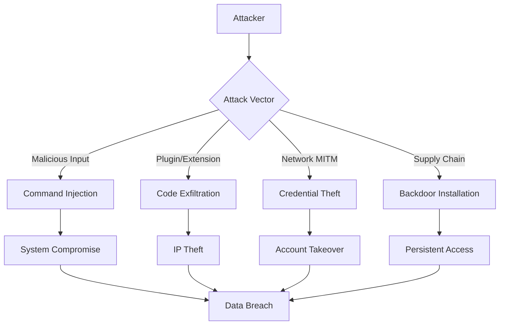

# CLAUDE Security Architecture: Defense-in-Depth Framework

**Document Version:** 1.0  
**Date:** 2025-01-27  
**Status:** Critical Security Specification  
**Classification:** Confidential  
**Alignment:** CLAUDE-BUILD-PLAN.md v2.0 MVP  
**Threat Level:** High (handles code, credentials, system access)

---

## Executive Summary

This document defines a **comprehensive, defense-in-depth security architecture** for the Gemini CLI AI Developer Toolkit. Given the toolkit's privileged access to source code, API credentials, and system commands, security is not optional—it is foundational to user trust and enterprise adoption.

### Security Mission

_"Protect user code, credentials, and systems with military-grade security following established industry standards while maintaining seamless developer experience."_

### 📚 Security Standards Compliance

**All security implementations MUST research and follow established standards:**

- **OWASP**: Application security guidelines and CLI security best practices
- **NIST**: Cybersecurity framework and security controls
- **Node.js Security**: Official Node.js security best practices
- **Industry RFCs**: Relevant security specifications and standards
- **Community Patterns**: Established security patterns in the Node.js/CLI ecosystem

### Risk Profile

- **Attack Surface**: Code analysis, API keys, shell execution, file system access
- **Threat Actors**: Nation-states, cybercriminals, malicious insiders, supply chain attacks
- **Impact**: Code theft, credential compromise, system compromise, supply chain injection
- **Criticality**: **CRITICAL** - Enterprise security dependency

---

## 🔐 Threat Model Analysis

### Primary Threat Vectors

#### T1: Code Exfiltration

**Risk**: High | **Impact**: Critical | **Likelihood**: Medium

- **Attack**: Malicious plugin or dependency exfiltrates proprietary source code
- **Mitigation**: Code analysis sandboxing, network isolation, data loss prevention

#### T2: Credential Theft

**Risk**: Critical | **Impact**: Critical | **Likelihood**: High

- **Attack**: API keys, authentication tokens stolen from storage or memory
- **Mitigation**: Hardware security modules, encrypted storage, credential rotation

#### T3: Command Injection

**Risk**: High | **Impact**: High | **Likelihood**: Medium

- **Attack**: Malicious input leads to arbitrary command execution
- **Mitigation**: Input sanitization, command whitelisting, process sandboxing

#### T4: Supply Chain Compromise

**Risk**: High | **Impact**: Critical | **Likelihood**: Medium

- **Attack**: Malicious dependencies inject backdoors or steal data
- **Mitigation**: Dependency scanning, SBOM validation, signed packages

#### T5: Privilege Escalation

**Risk**: Medium | **Impact**: High | **Likelihood**: Low

- **Attack**: Exploit leads to elevated system privileges
- **Mitigation**: Principle of least privilege, capability-based security

### Attack Scenarios



---

## 🛡️ Defense-in-Depth Architecture

### Layer 1: Perimeter Security

#### Network Security Controls

```typescript
interface NetworkSecurityConfig {
  // TLS Configuration
  tls: {
    minVersion: '1.3';
    cipherSuites: ['TLS_AES_256_GCM_SHA384', 'TLS_CHACHA20_POLY1305_SHA256'];
    certificatePinning: boolean;
    hsts: boolean;
  };

  // API Security
  api: {
    rateLimit: RateLimitConfig;
    ipAllowlist?: string[];
    userAgentValidation: boolean;
    requestSigning: boolean;
  };

  // Content Security
  content: {
    maxRequestSize: number;
    allowedMimeTypes: string[];
    virusScanEnabled: boolean;
  };
}

class NetworkSecurityManager {
  async validateRequest(request: Request): Promise<SecurityValidation> {
    // 1. Rate limiting
    await this.rateLimiter.checkLimit(request.user, request.endpoint);

    // 2. IP validation
    if (this.config.api.ipAllowlist) {
      this.validateClientIP(request.ip);
    }

    // 3. Request integrity
    if (this.config.api.requestSigning) {
      this.validateRequestSignature(request);
    }

    // 4. Content validation
    await this.validateRequestContent(request.body);

    return { valid: true, securityHeaders: this.generateSecurityHeaders() };
  }
}
```

#### Certificate Pinning & HSTS

```typescript
class CertificatePinning {
  private static readonly PINNED_CERTIFICATES = {
    'generativelanguage.googleapis.com': [
      'sha256/YLh1dUR9y6Kja30RrAn7JKnbQG/uEtLMkBgFF2Fuihg=',
      'sha256/sRHdihwgkaib1P1gxX8HFszlD+7/gTfNvuAybgLPNis=',
    ],
  };

  static validateCertificate(hostname: string, cert: Certificate): boolean {
    const pins = this.PINNED_CERTIFICATES[hostname];
    if (!pins) return true; // No pinning for this host

    const certFingerprint = crypto.createHash('sha256').update(cert.raw).digest('base64');

    return pins.includes(`sha256/${certFingerprint}`);
  }
}
```

### Layer 2: Authentication & Authorization

#### Multi-Factor Authentication Architecture

```typescript
interface AuthenticationFlow {
  // Primary authentication methods
  primary: 'gemini-subscription' | 'api-key' | 'service-account';

  // Optional second factor
  mfa?: {
    method: 'totp' | 'hardware-key' | 'biometric';
    required: boolean;
    backupCodes: boolean;
  };

  // Session management
  session: {
    duration: number;
    renewalThreshold: number;
    concurrentSessions: number;
    deviceBinding: boolean;
  };
}

class SecureAuthenticationManager {
  async authenticateWithMFA(credentials: AuthCredentials, mfaToken?: string): Promise<AuthenticationResult> {
    // 1. Primary authentication
    const primaryAuth = await this.validatePrimaryCredentials(credentials);
    if (!primaryAuth.valid) {
      await this.auditLogger.logAuthFailure('primary_auth_failed', credentials.userId);
      throw new AuthenticationError('Primary authentication failed');
    }

    // 2. Check MFA requirement
    const user = await this.getUserInfo(primaryAuth.userId);
    if (user.mfaRequired && !mfaToken) {
      return {
        success: false,
        mfaRequired: true,
        mfaMethod: user.preferredMfaMethod,
      };
    }

    // 3. Validate MFA if provided
    if (mfaToken) {
      const mfaValid = await this.validateMFA(user, mfaToken);
      if (!mfaValid) {
        await this.auditLogger.logAuthFailure('mfa_failed', user.id);
        throw new AuthenticationError('Multi-factor authentication failed');
      }
    }

    // 4. Create secure session
    const session = await this.createSecureSession(user);
    await this.auditLogger.logAuthSuccess(user.id, session.id);

    return { success: true, session };
  }
}
```

#### Role-Based Access Control (RBAC)

```typescript
enum Permission {
  READ_CODE = 'read:code',
  WRITE_CODE = 'write:code',
  EXECUTE_SHELL = 'execute:shell',
  ACCESS_CREDENTIALS = 'access:credentials',
  MODIFY_CONFIG = 'modify:config',
  ADMIN_USERS = 'admin:users',
}

interface Role {
  name: string;
  permissions: Permission[];
  constraints?: AccessConstraints;
}

interface AccessConstraints {
  ipRestrictions?: string[];
  timeRestrictions?: TimeRange[];
  locationRestrictions?: GeoLocation[];
  deviceRestrictions?: string[];
}

class AccessControlManager {
  private static readonly ROLES: Record<string, Role> = {
    developer: {
      name: 'Developer',
      permissions: [Permission.READ_CODE, Permission.WRITE_CODE],
    },
    'senior-developer': {
      name: 'Senior Developer',
      permissions: [Permission.READ_CODE, Permission.WRITE_CODE, Permission.EXECUTE_SHELL],
    },
    admin: {
      name: 'Administrator',
      permissions: Object.values(Permission),
    },
  };

  async checkPermission(user: User, permission: Permission, context: AccessContext): Promise<boolean> {
    // 1. Get user roles
    const userRoles = await this.getUserRoles(user);

    // 2. Check if any role grants permission
    const hasPermission = userRoles.some(role => role.permissions.includes(permission));

    if (!hasPermission) {
      return false;
    }

    // 3. Check constraints
    for (const role of userRoles) {
      if (role.constraints) {
        const constraintsMet = await this.validateConstraints(role.constraints, context);
        if (!constraintsMet) {
          return false;
        }
      }
    }

    return true;
  }
}
```

### Layer 3: Input Validation & Sanitization

#### Comprehensive Input Validation Framework

```typescript
class SecurityInputValidator {
  private static readonly PATTERNS = {
    FILE_PATH: /^[a-zA-Z0-9._/-]{1,255}$/,
    SHELL_SAFE: /^[a-zA-Z0-9._\-/\s]{1,1000}$/,
    API_KEY: /^[A-Za-z0-9_-]{32,128}$/,
    EMAIL: /^[^\s@]+@[^\s@]+\.[^\s@]+$/,
  };

  private static readonly DANGEROUS_PATTERNS = [
    // Command injection
    /[;&|`$()]/,
    /\$\{.*\}/,

    // Path traversal
    /\.\./,
    /~[\/\\]/,

    // Script injection
    /<script/i,
    /javascript:/i,

    // SQL injection
    /('|(\\r)|(\\n)|(\\r\\n)|(\\x00)|(\\x1a))/,
    /(union|select|insert|update|delete|drop|create|alter)/i,
  ];

  static validateInput(
    input: string,
    type: 'file_path' | 'shell_command' | 'api_key' | 'email' | 'generic',
    options: ValidationOptions = {}
  ): ValidationResult {
    // 1. Basic validation
    if (!input || input.length === 0) {
      if (options.required) {
        throw new ValidationError('Input is required');
      }
      return { valid: true, sanitized: '' };
    }

    // 2. Length validation
    if (input.length > (options.maxLength || 10000)) {
      throw new ValidationError('Input too long');
    }

    // 3. Dangerous pattern detection
    for (const pattern of this.DANGEROUS_PATTERNS) {
      if (pattern.test(input)) {
        throw new SecurityError(`Dangerous pattern detected: ${pattern}`);
      }
    }

    // 4. Type-specific validation
    const pattern = this.PATTERNS[type.toUpperCase() as keyof typeof this.PATTERNS];
    if (pattern && !pattern.test(input)) {
      throw new ValidationError(`Invalid ${type} format`);
    }

    // 5. Sanitization
    const sanitized = this.sanitizeInput(input, type);

    return { valid: true, sanitized };
  }

  private static sanitizeInput(input: string, type: string): string {
    switch (type) {
      case 'file_path':
        return path.normalize(input.replace(/[<>:"|?*]/g, ''));

      case 'shell_command':
        return input.replace(/[;&|`$(){}[\]]/g, '');

      case 'email':
        return input.toLowerCase().trim();

      default:
        return input.trim();
    }
  }
}
```

#### Content Security Policy (CSP) for Web Components

```typescript
const CONTENT_SECURITY_POLICY = {
  'default-src': "'self'",
  'script-src': "'self' 'unsafe-inline'",
  'style-src': "'self' 'unsafe-inline'",
  'img-src': "'self' data: https:",
  'connect-src': "'self' https://generativelanguage.googleapis.com",
  'font-src': "'self'",
  'object-src': "'none'",
  'media-src': "'self'",
  'frame-src': "'none'",
  'base-uri': "'self'",
  'form-action': "'self'",
};
```

### Layer 4: Data Protection & Encryption

#### Encryption at Rest

```typescript
class DataEncryptionManager {
  private static readonly ENCRYPTION_CONFIG = {
    algorithm: 'aes-256-gcm' as const,
    keyDerivation: 'argon2id' as const,
    // Argon2id parameters (OWASP 2024 recommendations)
    memoryCost: 65536, // 64MB memory cost
    timeCost: 3, // 3 iterations
    parallelism: 4, // 4 parallel threads
    keyLength: 32,
    ivLength: 16,
    tagLength: 16,
    saltLength: 32,
    // Fallback configuration for compatibility
    fallback: {
      keyDerivation: 'scrypt' as const,
      N: 32768, // CPU/memory cost parameter (2^15)
      r: 8, // Block size parameter
      p: 1, // Parallelization parameter
      maxmem: 64 * 1024 * 1024, // 64MB max memory
    },
  };

  static async encryptSensitiveData(data: string, context: EncryptionContext): Promise<EncryptedData> {
    // 1. Generate cryptographic components
    const salt = crypto.randomBytes(this.ENCRYPTION_CONFIG.saltLength);
    const iv = crypto.randomBytes(this.ENCRYPTION_CONFIG.ivLength);

    // 2. Derive encryption key
    const key = await this.deriveKey(context.masterKey, salt);

    // 3. Encrypt data
    const cipher = crypto.createCipheriv(this.ENCRYPTION_CONFIG.algorithm, key, iv);
    const encrypted = Buffer.concat([cipher.update(data, 'utf8'), cipher.final()]);

    // 4. Get authentication tag
    const authTag = cipher.getAuthTag();

    // 5. Combine components
    return {
      data: Buffer.concat([salt, iv, authTag, encrypted]).toString('base64'),
      algorithm: this.ENCRYPTION_CONFIG.algorithm,
      timestamp: Date.now(),
    };
  }

  static async decryptSensitiveData(encryptedData: EncryptedData, context: EncryptionContext): Promise<string> {
    const combined = Buffer.from(encryptedData.data, 'base64');

    // 1. Extract components
    const salt = combined.slice(0, this.ENCRYPTION_CONFIG.saltLength);
    const iv = combined.slice(
      this.ENCRYPTION_CONFIG.saltLength,
      this.ENCRYPTION_CONFIG.saltLength + this.ENCRYPTION_CONFIG.ivLength
    );
    const authTag = combined.slice(
      this.ENCRYPTION_CONFIG.saltLength + this.ENCRYPTION_CONFIG.ivLength,
      this.ENCRYPTION_CONFIG.saltLength + this.ENCRYPTION_CONFIG.ivLength + this.ENCRYPTION_CONFIG.tagLength
    );
    const encrypted = combined.slice(
      this.ENCRYPTION_CONFIG.saltLength + this.ENCRYPTION_CONFIG.ivLength + this.ENCRYPTION_CONFIG.tagLength
    );

    // 2. Derive decryption key
    const key = await this.deriveKey(context.masterKey, salt);

    // 3. Decrypt data
    const decipher = crypto.createDecipheriv(this.ENCRYPTION_CONFIG.algorithm, key, iv);
    decipher.setAuthTag(authTag);

    const decrypted = Buffer.concat([decipher.update(encrypted), decipher.final()]);

    return decrypted.toString('utf8');
  }

  private static async deriveKey(masterKey: string, salt: Buffer): Promise<Buffer> {
    const config = this.ENCRYPTION_CONFIG;

    try {
      // Primary: Argon2id (OWASP 2024 recommended)
      if (config.keyDerivation === 'argon2id') {
        const argon2 = require('argon2');

        return await argon2.hash(masterKey, {
          type: argon2.argon2id,
          memoryCost: config.memoryCost,
          timeCost: config.timeCost,
          parallelism: config.parallelism,
          salt: salt,
          raw: true,
          hashLength: config.keyLength,
        });
      }
    } catch (error) {
      // Log Argon2 failure but continue to fallback
      console.warn('Argon2id key derivation failed, falling back to scrypt:', error.message);
    }

    try {
      // Fallback: scrypt (better than PBKDF2)
      const fallbackConfig = config.fallback;

      return crypto.scryptSync(masterKey, salt, config.keyLength, {
        N: fallbackConfig.N,
        r: fallbackConfig.r,
        p: fallbackConfig.p,
        maxmem: fallbackConfig.maxmem,
      });
    } catch (error) {
      // Final fallback: PBKDF2 (deprecated but compatible)
      console.warn('Scrypt key derivation failed, falling back to PBKDF2:', error.message);

      return crypto.pbkdf2Sync(
        masterKey,
        salt,
        100000, // Legacy iteration count
        config.keyLength,
        'sha256'
      );
    }
  }

  /**
   * Enhanced key derivation with algorithm selection and verification
   * Implements defense-in-depth by supporting multiple KDF algorithms
   */
  static async deriveKeyWithVerification(
    masterKey: string,
    salt: Buffer,
    algorithm?: 'argon2id' | 'scrypt' | 'pbkdf2'
  ): Promise<{ key: Buffer; algorithm: string; metrics: KeyDerivationMetrics }> {
    const startTime = Date.now();
    let derivedKey: Buffer;
    let usedAlgorithm: string;

    try {
      switch (algorithm || this.ENCRYPTION_CONFIG.keyDerivation) {
        case 'argon2id':
          derivedKey = await this.deriveKeyArgon2id(masterKey, salt);
          usedAlgorithm = 'argon2id';
          break;

        case 'scrypt':
          derivedKey = await this.deriveKeyScrypt(masterKey, salt);
          usedAlgorithm = 'scrypt';
          break;

        case 'pbkdf2':
          derivedKey = await this.deriveKeyPBKDF2(masterKey, salt);
          usedAlgorithm = 'pbkdf2';
          break;

        default:
          throw new SecurityError(`Unsupported key derivation algorithm: ${algorithm}`);
      }

      const derivationTime = Date.now() - startTime;

      // Verify key strength
      const keyEntropy = this.calculateKeyEntropy(derivedKey);
      if (keyEntropy < 7.5) {
        // Minimum entropy threshold
        throw new SecurityError('Derived key has insufficient entropy');
      }

      const metrics: KeyDerivationMetrics = {
        algorithm: usedAlgorithm,
        derivationTime,
        keyEntropy,
        saltLength: salt.length,
        keyLength: derivedKey.length,
        timestamp: Date.now(),
      };

      return { key: derivedKey, algorithm: usedAlgorithm, metrics };
    } catch (error) {
      throw new SecurityError(`Key derivation failed: ${error.message}`);
    }
  }

  private static async deriveKeyArgon2id(masterKey: string, salt: Buffer): Promise<Buffer> {
    const argon2 = require('argon2');
    const config = this.ENCRYPTION_CONFIG;

    return await argon2.hash(masterKey, {
      type: argon2.argon2id,
      memoryCost: config.memoryCost,
      timeCost: config.timeCost,
      parallelism: config.parallelism,
      salt: salt,
      raw: true,
      hashLength: config.keyLength,
    });
  }

  private static async deriveKeyScrypt(masterKey: string, salt: Buffer): Promise<Buffer> {
    const config = this.ENCRYPTION_CONFIG.fallback;

    return crypto.scryptSync(masterKey, salt, this.ENCRYPTION_CONFIG.keyLength, {
      N: config.N,
      r: config.r,
      p: config.p,
      maxmem: config.maxmem,
    });
  }

  private static async deriveKeyPBKDF2(masterKey: string, salt: Buffer): Promise<Buffer> {
    return crypto.pbkdf2Sync(
      masterKey,
      salt,
      100000, // Legacy but secure iteration count
      this.ENCRYPTION_CONFIG.keyLength,
      'sha256'
    );
  }

  private static calculateKeyEntropy(key: Buffer): number {
    // Shannon entropy calculation
    const frequencies = new Array(256).fill(0);

    for (const byte of key) {
      frequencies[byte]++;
    }

    let entropy = 0;
    const length = key.length;

    for (let i = 0; i < 256; i++) {
      if (frequencies[i] > 0) {
        const probability = frequencies[i] / length;
        entropy -= probability * Math.log2(probability);
      }
    }

    return entropy;
  }
}
```

#### Secure Key Management

```typescript
interface KeyManagementSystem {
  generateKey(usage: KeyUsage): Promise<CryptographicKey>;
  rotateKey(keyId: string): Promise<void>;
  revokeKey(keyId: string): Promise<void>;
  getKey(keyId: string): Promise<CryptographicKey | null>;
}

// Master Key Storage Configuration (NIST SP 800-57 Compliant)
interface MasterKeyStorageConfig {
  // Platform-specific secure storage
  storage: {
    // Windows Data Protection API (DPAPI)
    windows: {
      scope: 'CurrentUser' | 'LocalMachine';
      entropy?: Buffer;
      flags?: number;
    };
    // macOS Keychain Services
    macos: {
      service: string;
      account: string;
      accessGroup?: string;
      accessibility: 'WhenUnlocked' | 'WhenUnlockedThisDeviceOnly' | 'AfterFirstUnlock';
      synchronizable?: boolean;
    };
    // Linux Secret Service (libsecret) / Keyring
    linux: {
      collection: string;
      label: string;
      attributes: Record<string, string>;
      password?: string;
    };
  };

  // Key rotation policy (NIST SP 800-57 Part 1 Rev. 5)
  rotation: {
    interval: 90 * 24 * 60 * 60 * 1000; // 90 days in milliseconds
    gracePeriod: 7 * 24 * 60 * 60 * 1000; // 7 days grace period
    maxKeyAge: 365 * 24 * 60 * 60 * 1000; // 1 year maximum
    autoRotate: boolean;
    notificationThreshold: 7 * 24 * 60 * 60 * 1000; // 7 days before expiry
  };

  // Hardware Security Module / TPM integration
  hsm: {
    enabled: boolean;
    type: 'tpm2' | 'pkcs11' | 'azure-key-vault' | 'aws-kms' | 'hashicorp-vault';
    config: HsmConfig;
    fallbackToSoftware: boolean;
  };

  // Environment variable fallback
  environmentFallback: {
    keyVariable: 'GEMINI_MASTER_KEY_STORAGE';
    locationVariable: 'GEMINI_KEY_STORAGE_PATH';
    enabledVariable: 'GEMINI_USE_ENV_STORAGE';
    encryptionVariable: 'GEMINI_ENV_KEY_ENCRYPTED';
  };
}

class SecureMasterKeyStorage {
  private static readonly STORAGE_CONFIG: MasterKeyStorageConfig = {
    storage: {
      windows: {
        scope: 'CurrentUser',
        entropy: Buffer.from('gemini-cli-entropy-v1', 'utf8'),
        flags: 0x01 // CRYPTPROTECT_UI_FORBIDDEN
      },
      macos: {
        service: 'com.anthropic.gemini-cli',
        account: 'master-key',
        accessibility: 'WhenUnlockedThisDeviceOnly',
        synchronizable: false
      },
      linux: {
        collection: 'default',
        label: 'Gemini CLI Master Key',
        attributes: {
          'application': 'gemini-cli',
          'type': 'master-key',
          'version': '1.0'
        }
      }
    },
    rotation: {
      interval: 90 * 24 * 60 * 60 * 1000,
      gracePeriod: 7 * 24 * 60 * 60 * 1000,
      maxKeyAge: 365 * 24 * 60 * 60 * 1000,
      autoRotate: true,
      notificationThreshold: 7 * 24 * 60 * 60 * 1000
    },
    hsm: {
      enabled: false,
      type: 'tpm2',
      config: {},
      fallbackToSoftware: true
    },
    environmentFallback: {
      keyVariable: 'GEMINI_MASTER_KEY_STORAGE',
      locationVariable: 'GEMINI_KEY_STORAGE_PATH',
      enabledVariable: 'GEMINI_USE_ENV_STORAGE',
      encryptionVariable: 'GEMINI_ENV_KEY_ENCRYPTED'
    }
  };

  /**
   * Stores master key using platform-specific secure storage
   * Follows NIST SP 800-57 Part 1 Rev. 5 guidelines
   */
  static async storeMasterKey(
    masterKey: Buffer,
    keyId: string,
    metadata: KeyMetadata = {}
  ): Promise<StorageResult> {
    try {
      // 1. Check for HSM/TPM availability
      if (this.STORAGE_CONFIG.hsm.enabled) {
        const hsmResult = await this.storeInHSM(masterKey, keyId, metadata);
        if (hsmResult.success) {
          return hsmResult;
        }

        if (!this.STORAGE_CONFIG.hsm.fallbackToSoftware) {
          throw new Error('HSM storage required but failed, fallback disabled');
        }
      }

      // 2. Platform-specific secure storage
      switch (process.platform) {
        case 'win32':
          return await this.storeWindowsDPAPI(masterKey, keyId, metadata);
        case 'darwin':
          return await this.storeMacOSKeychain(masterKey, keyId, metadata);
        case 'linux':
          return await this.storeLinuxKeyring(masterKey, keyId, metadata);
        default:
          // 3. Environment variable fallback
          return await this.storeEnvironmentFallback(masterKey, keyId, metadata);
      }
    } finally {
      // Secure cleanup
      SecureMemoryManager.secureFree(masterKey);
    }
  }

  /**
   * Windows DPAPI secure storage
   */
  private static async storeWindowsDPAPI(
    masterKey: Buffer,
    keyId: string,
    metadata: KeyMetadata
  ): Promise<StorageResult> {
    try {
      const dpapi = require('win32-api');
      const config = this.STORAGE_CONFIG.storage.windows;

      const protectedData = dpapi.CryptProtectData(
        masterKey,
        `Gemini CLI Master Key: ${keyId}`,
        config.entropy,
        null,
        null,
        config.flags
      );

      const storageData = {
        protectedKey: protectedData.toString('base64'),
        metadata: {
          ...metadata,
          keyId,
          platform: 'windows',
          storage: 'dpapi',
          created: Date.now(),
          lastRotation: Date.now()
        }
      };

      // Store in Windows Registry
      const registryPath = `HKEY_CURRENT_USER\\Software\\Anthropic\\GeminiCLI\\Keys\\${keyId}`;
      await this.writeSecureRegistry(registryPath, storageData);

      return {
        success: true,
        keyId,
        storage: 'windows-dpapi',
        expiresAt: Date.now() + this.STORAGE_CONFIG.rotation.interval
      };
    } catch (error) {
      throw new SecurityError(`Windows DPAPI storage failed: ${error.message}`);
    }
  }

  /**
   * macOS Keychain secure storage
   */
  private static async storeMacOSKeychain(
    masterKey: Buffer,
    keyId: string,
    metadata: KeyMetadata
  ): Promise<StorageResult> {
    try {
      const keychain = require('keychain');
      const config = this.STORAGE_CONFIG.storage.macos;

      const keychainItem = {
        service: config.service,
        account: `${config.account}-${keyId}`,
        password: masterKey.toString('base64'),
        type: 'internet',
        kind: 'application password',
        comment: `Gemini CLI Master Key - ${keyId}`,
        creator: 'GmCL',
        protection: config.accessibility,
        synchronizable: config.synchronizable
      };

      await new Promise((resolve, reject) => {
        keychain.setPassword(keychainItem, (err) => {
          if (err) reject(err);
          else resolve(true);
        });
      });

      // Store metadata separately
      const metadataItem = {
        ...keychainItem,
        account: `${config.account}-${keyId}-meta`,
        password: JSON.stringify({
          ...metadata,
          keyId,
          platform: 'macos',
          storage: 'keychain',
          created: Date.now(),
          lastRotation: Date.now()
        })
      };

      await new Promise((resolve, reject) => {
        keychain.setPassword(metadataItem, (err) => {
          if (err) reject(err);
          else resolve(true);
        });
      });

      return {
        success: true,
        keyId,
        storage: 'macos-keychain',
        expiresAt: Date.now() + this.STORAGE_CONFIG.rotation.interval
      };
    } catch (error) {
      throw new SecurityError(`macOS Keychain storage failed: ${error.message}`);
    }
  }

  /**
   * Linux keyring secure storage (libsecret/keyring)
   */
  private static async storeLinuxKeyring(
    masterKey: Buffer,
    keyId: string,
    metadata: KeyMetadata
  ): Promise<StorageResult> {
    try {
      const secret = require('node-keytar');
      const config = this.STORAGE_CONFIG.storage.linux;

      const service = `${config.label}-${keyId}`;
      const account = process.env.USER || 'unknown';

      // Store master key
      await secret.setPassword(service, account, masterKey.toString('base64'));

      // Store metadata
      const metadataService = `${service}-metadata`;
      const metadataPayload = JSON.stringify({
        ...metadata,
        keyId,
        platform: 'linux',
        storage: 'keyring',
        created: Date.now(),
        lastRotation: Date.now(),
        collection: config.collection,
        attributes: config.attributes
      });

      await secret.setPassword(metadataService, account, metadataPayload);

      return {
        success: true,
        keyId,
        storage: 'linux-keyring',
        expiresAt: Date.now() + this.STORAGE_CONFIG.rotation.interval
      };
    } catch (error) {
      // Fallback to encrypted file storage on Linux
      return await this.storeEncryptedFile(masterKey, keyId, metadata);
    }
  }

  /**
   * Environment variable fallback storage (encrypted)
   */
  private static async storeEnvironmentFallback(
    masterKey: Buffer,
    keyId: string,
    metadata: KeyMetadata
  ): Promise<StorageResult> {
    const config = this.STORAGE_CONFIG.environmentFallback;

    if (!process.env[config.enabledVariable]) {
      throw new SecurityError('Environment fallback storage not enabled');
    }

    try {
      // Derive storage encryption key from system entropy
      const systemKey = await this.deriveSystemKey();

      // Encrypt master key
      const encryptedKey = await DataEncryptionManager.encryptSensitiveData(
        masterKey.toString('base64'),
        { masterKey: systemKey }
      );

      const storageData = {
        encryptedMasterKey: encryptedKey,
        metadata: {
          ...metadata,
          keyId,
          platform: process.platform,
          storage: 'environment',
          created: Date.now(),
          lastRotation: Date.now()
        }
      };

      // Store in specified location or default
      const storagePath = process.env[config.locationVariable] ||
        path.join(os.homedir(), '.gemini-cli', 'secure');

      await fs.mkdir(path.dirname(storagePath), { recursive: true, mode: 0o700 });
      await fs.writeFile(
        path.join(storagePath, `key-${keyId}.enc`),
        JSON.stringify(storageData),
        { mode: 0o600 }
      );

      return {
        success: true,
        keyId,
        storage: 'environment-encrypted',
        expiresAt: Date.now() + this.STORAGE_CONFIG.rotation.interval
      };
    } catch (error) {
      throw new SecurityError(`Environment fallback storage failed: ${error.message}`);
    }
  }

  /**
   * HSM/TPM secure storage
   */
  private static async storeInHSM(
    masterKey: Buffer,
    keyId: string,
    metadata: KeyMetadata
  ): Promise<StorageResult> {
    const hsmConfig = this.STORAGE_CONFIG.hsm;

    switch (hsmConfig.type) {
      case 'tpm2':
        return await this.storeTPM2(masterKey, keyId, metadata);
      case 'pkcs11':
        return await this.storePKCS11(masterKey, keyId, metadata);
      case 'azure-key-vault':
        return await this.storeAzureKV(masterKey, keyId, metadata);
      case 'aws-kms':
        return await this.storeAWSKMS(masterKey, keyId, metadata);
      case 'hashicorp-vault':
        return await this.storeHashiCorpVault(masterKey, keyId, metadata);
      default:
        throw new SecurityError(`Unsupported HSM type: ${hsmConfig.type}`);
    }
  }

  /**
   * Automatic key rotation following NIST guidelines
   */
  static async rotateExpiredKeys(): Promise<RotationResult[]> {
    const config = this.STORAGE_CONFIG.rotation;
    const results: RotationResult[] = [];

    try {
      const storedKeys = await this.listStoredKeys();
      const now = Date.now();

      for (const keyInfo of storedKeys) {
        const age = now - keyInfo.created;
        const timeSinceRotation = now - (keyInfo.lastRotation || keyInfo.created);

        // Check if rotation is needed
        if (timeSinceRotation >= config.interval || age >= config.maxKeyAge) {
          try {
            // Generate new key
            const newMasterKey = crypto.randomBytes(32);
            const newKeyId = `mk_${Date.now()}_${crypto.randomBytes(8).toString('hex')}`;

            // Store new key
            const storeResult = await this.storeMasterKey(
              newMasterKey,
              newKeyId,
              { ...keyInfo.metadata, rotatedFrom: keyInfo.keyId }
            );

            // Keep old key for grace period
            await this.markKeyForGracefulRetirement(keyInfo.keyId, config.gracePeriod);

            results.push({
              oldKeyId: keyInfo.keyId,
              newKeyId,
              rotationTime: now,
              gracePeriodEnd: now + config.gracePeriod,
              success: true
            });

            SecureMemoryManager.secureFree(newMasterKey);
          } catch (error) {
            results.push({
              oldKeyId: keyInfo.keyId,
              newKeyId: null,
              rotationTime: now,
              gracePeriodEnd: null,
              success: false,
              error: error.message
            });
          }
        }
      }

      return results;
    } catch (error) {
      throw new SecurityError(`Key rotation failed: ${error.message}`);
    }
  }
}

class HardwareSecurityModule implements KeyManagementSystem {
  async generateKey(usage: KeyUsage): Promise<CryptographicKey> {
    // Use platform-specific HSM/TPM when available
    switch (process.platform) {
      case 'win32':
        return this.generateWindowsCNGKey(usage);
      case 'darwin':
        return this.generateSecureEnclaveKey(usage);
      default:
        return this.generateLinuxHSMKey(usage);
    }
  }

  private async generateSecureEnclaveKey(usage: KeyUsage): Promise<CryptographicKey> {
    // macOS Secure Enclave integration
    const keychain = require('@keychain/node');

    return keychain.generateKey({
      usage,
      protection: 'secure-enclave',
      biometry: true,
      accessibility: 'when-unlocked-this-device-only'
    });
  }
}
```

### Layer 5: Runtime Security

#### Process Sandboxing

```typescript
class ProcessSandbox {
  static async executeInSandbox(command: string, args: string[], options: SandboxOptions = {}): Promise<SandboxResult> {
    // 1. Create restricted environment
    const sandboxEnv = this.createRestrictedEnvironment();

    // 2. Apply resource limits
    const limits = {
      memory: options.maxMemory || 256 * 1024 * 1024, // 256MB
      cpu: options.maxCpuTime || 30000, // 30 seconds
      processes: options.maxProcesses || 5,
      files: options.maxFiles || 100,
    };

    // 3. Platform-specific sandboxing
    switch (process.platform) {
      case 'linux':
        return this.executeInLinuxSandbox(command, args, limits);
      case 'darwin':
        return this.executeInDarwinSandbox(command, args, limits);
      case 'win32':
        return this.executeInWindowsSandbox(command, args, limits);
      default:
        throw new Error('Unsupported platform for sandboxing');
    }
  }

  private static async executeInLinuxSandbox(
    command: string,
    args: string[],
    limits: ResourceLimits
  ): Promise<SandboxResult> {
    // Use Linux namespaces and cgroups for isolation
    const sandboxArgs = [
      'unshare',
      '--user',
      '--pid',
      '--net',
      '--mount',
      '--fork',
      '--kill-child',
      'timeout',
      limits.cpu.toString(),
      'systemd-run',
      '--user',
      '--scope',
      `-p`,
      `MemoryMax=${limits.memory}`,
      '-p',
      `TasksMax=${limits.processes}`,
      command,
      ...args,
    ];

    return this.executeWithLimits(sandboxArgs, limits);
  }
}
```

#### Memory Protection

```typescript
class SecureMemoryManager {
  private static sensitiveData = new Map<string, WeakRef<Buffer>>();
  private static readonly ZEROIZATION_PATTERNS = [0xff, 0x00, 0xaa, 0x55, 0x00];
  private static readonly MAX_SECURE_MEMORY_SIZE = 256 * 1024 * 1024; // 256MB limit

  /**
   * Secure memory allocation with automatic cleanup registration
   * Following NIST SP 800-88 Rev. 1 media sanitization guidelines
   */
  static secureAllocate(size: number, usage: string): SecureBuffer {
    if (size > this.MAX_SECURE_MEMORY_SIZE) {
      throw new SecurityError(`Requested memory size ${size} exceeds maximum ${this.MAX_SECURE_MEMORY_SIZE}`);
    }

    // Allocate secure memory with page alignment when possible
    const buffer = Buffer.allocUnsafeSlow(size);

    // Initial secure clearing
    this.secureMemoryWipe(buffer);

    // Register for secure cleanup
    const weakRef = new WeakRef(buffer);
    this.sensitiveData.set(usage, weakRef);

    // Set up automatic cleanup with enhanced patterns
    const cleanup = () => {
      if (buffer) {
        this.secureMemoryWipe(buffer);
      }
    };

    // Register cleanup for multiple termination scenarios
    process.on('exit', cleanup);
    process.on('SIGTERM', cleanup);
    process.on('SIGINT', cleanup);
    process.on('SIGUSR1', cleanup);
    process.on('SIGUSR2', cleanup);
    process.on('uncaughtException', cleanup);
    process.on('unhandledRejection', cleanup);

    return new SecureBuffer(buffer, usage);
  }

  /**
   * Multi-pass secure memory clearing following DoD 5220.22-M standard
   * Implements defense against data recovery attacks
   */
  static secureFree(buffer: SecureBuffer | Buffer): boolean {
    try {
      const targetBuffer = buffer instanceof SecureBuffer ? buffer.underlying : buffer;

      if (!targetBuffer || targetBuffer.length === 0) {
        return true; // Nothing to clear
      }

      // Multi-pass overwrite with different patterns
      const success = this.secureMemoryWipe(targetBuffer);

      // Remove from tracking
      if (buffer instanceof SecureBuffer && buffer.usage) {
        this.sensitiveData.delete(buffer.usage);
      }

      // Force multiple garbage collection cycles
      this.forceGarbageCollection();

      return success;
    } catch (error) {
      console.error('Secure memory free failed:', error.message);
      return false;
    }
  }

  /**
   * Multi-pass secure memory wiping implementation
   * Follows NIST SP 800-88 Rev. 1 guidelines for cryptographic erase
   */
  private static secureMemoryWipe(buffer: Buffer): boolean {
    if (!buffer || buffer.length === 0) {
      return true;
    }

    try {
      const originalBuffer = Buffer.from(buffer); // Backup for verification

      // Pass 1-4: Multi-pattern overwrite (DoD 5220.22-M inspired)
      for (const pattern of this.ZEROIZATION_PATTERNS) {
        buffer.fill(pattern);

        // Memory barrier to prevent compiler optimization
        this.memoryBarrier();

        // Verify the write was successful
        if (!this.verifyBufferPattern(buffer, pattern)) {
          console.warn(`Memory wipe verification failed for pattern 0x${pattern.toString(16).padStart(2, '0')}`);
        }
      }

      // Final pass: Random data (defense against pattern analysis)
      const randomData = crypto.randomBytes(buffer.length);
      randomData.copy(buffer);
      this.memoryBarrier();

      // Verify final random overwrite
      const finalVerification = crypto.timingSafeEqual(buffer, randomData);
      if (!finalVerification) {
        console.warn('Final random overwrite verification failed');
      }

      // Final zero pass
      buffer.fill(0);
      this.memoryBarrier();

      // Secure verification using timing-safe comparison
      const zeroBuffer = Buffer.alloc(buffer.length, 0);
      const zeroVerification = crypto.timingSafeEqual(buffer, zeroBuffer);

      if (!zeroVerification) {
        console.error('Critical: Final zero verification failed - memory may not be cleared');
        return false;
      }

      // Secure cleanup of verification buffers
      randomData.fill(0);
      zeroBuffer.fill(0);
      originalBuffer.fill(0);

      return true;
    } catch (error) {
      console.error('Secure memory wipe failed:', error.message);
      return false;
    }
  }

  /**
   * Memory barrier to prevent compiler/CPU optimizations from eliminating writes
   */
  private static memoryBarrier(): void {
    // Use crypto operation as memory barrier (can't be optimized away)
    crypto.randomBytes(1);

    // Additional barriers for different scenarios
    if (typeof process !== 'undefined' && process.nextTick) {
      process.nextTick(() => {});
    }
  }

  /**
   * Verify buffer contains expected pattern
   */
  private static verifyBufferPattern(buffer: Buffer, pattern: number): boolean {
    try {
      for (let i = 0; i < buffer.length; i++) {
        if (buffer[i] !== pattern) {
          return false;
        }
      }
      return true;
    } catch (error) {
      return false;
    }
  }

  /**
   * Enhanced garbage collection with multiple strategies
   */
  private static forceGarbageCollection(): void {
    try {
      // Force multiple GC cycles to ensure memory is actually freed
      for (let i = 0; i < 3; i++) {
        if (global.gc) {
          global.gc();
        }

        // Alternative GC triggers for different Node.js versions
        if (process.memoryUsage) {
          process.memoryUsage(); // Can trigger GC internally
        }

        // Small delay to allow GC to complete
        if (typeof setImmediate !== 'undefined') {
          setImmediate(() => {});
        }
      }

      // Final full GC attempt
      if (global.gc) {
        global.gc();
      }
    } catch (error) {
      console.warn('Forced garbage collection failed:', error.message);
    }
  }

  /**
   * Secure cleanup of all registered sensitive memory
   * Should be called on application shutdown
   */
  static secureCleanupAll(): Promise<boolean> {
    return new Promise(resolve => {
      let cleanupCount = 0;
      let successCount = 0;

      // Clean all registered sensitive data
      for (const [usage, weakRef] of this.sensitiveData.entries()) {
        const buffer = weakRef.deref();
        if (buffer) {
          cleanupCount++;
          if (this.secureFree(new SecureBuffer(buffer, usage))) {
            successCount++;
          }
        }
      }

      // Clear the registry
      this.sensitiveData.clear();

      // Final system-wide garbage collection
      this.forceGarbageCollection();

      const success = cleanupCount === successCount;
      if (!success) {
        console.error(`Secure cleanup partial failure: ${successCount}/${cleanupCount} buffers cleaned`);
      }

      resolve(success);
    });
  }

  /**
   * Memory usage monitoring for security purposes
   */
  static getSecureMemoryStats(): SecureMemoryStats {
    let totalTracked = 0;
    let activeBuffers = 0;

    for (const [usage, weakRef] of this.sensitiveData.entries()) {
      const buffer = weakRef.deref();
      if (buffer) {
        activeBuffers++;
        totalTracked += buffer.length;
      }
    }

    const memUsage = process.memoryUsage();

    return {
      trackedBuffers: activeBuffers,
      totalTrackedBytes: totalTracked,
      heapUsed: memUsage.heapUsed,
      heapTotal: memUsage.heapTotal,
      external: memUsage.external,
      rss: memUsage.rss,
      timestamp: Date.now(),
    };
  }
}

/**
 * Enhanced secure buffer wrapper with automatic cleanup
 */
class SecureBuffer {
  public readonly underlying: Buffer;
  public readonly usage: string;
  public readonly created: number;
  private _freed: boolean = false;

  constructor(buffer: Buffer, usage: string = 'anonymous') {
    this.underlying = buffer;
    this.usage = usage;
    this.created = Date.now();

    // Set up finalizer for automatic cleanup if manually missed
    const cleanup = new FinalizationRegistry((heldValue: { buffer: Buffer; usage: string }) => {
      if (!this._freed) {
        console.warn(`SecureBuffer '${heldValue.usage}' was not manually freed, performing automatic cleanup`);
        SecureMemoryManager.secureMemoryWipe(heldValue.buffer);
      }
    });

    cleanup.register(this, { buffer: this.underlying, usage: this.usage });
  }

  /**
   * Get buffer size
   */
  get length(): number {
    return this.underlying.length;
  }

  /**
   * Check if buffer has been freed
   */
  get isFreed(): boolean {
    return this._freed;
  }

  /**
   * Secure read access to buffer data
   */
  read(): Buffer {
    if (this._freed) {
      throw new SecurityError('Cannot read from freed SecureBuffer');
    }
    return Buffer.from(this.underlying); // Return a copy for safety
  }

  /**
   * Secure write to buffer
   */
  write(data: Buffer, offset: number = 0): number {
    if (this._freed) {
      throw new SecurityError('Cannot write to freed SecureBuffer');
    }
    return data.copy(this.underlying, offset);
  }

  /**
   * Manual cleanup of secure buffer
   */
  free(): boolean {
    if (this._freed) {
      return true;
    }

    const success = SecureMemoryManager.secureFree(this);
    if (success) {
      this._freed = true;
    }

    return success;
  }

  /**
   * String representation for debugging (without exposing data)
   */
  toString(): string {
    return `SecureBuffer(usage=${this.usage}, length=${this.length}, freed=${this._freed}, age=${Date.now() - this.created}ms)`;
  }
}

// Type definitions for enhanced security
interface SecureMemoryStats {
  trackedBuffers: number;
  totalTrackedBytes: number;
  heapUsed: number;
  heapTotal: number;
  external: number;
  rss: number;
  timestamp: number;
}

interface KeyDerivationMetrics {
  algorithm: string;
  derivationTime: number;
  keyEntropy: number;
  saltLength: number;
  keyLength: number;
  timestamp: number;
}
```

### Layer 6: Monitoring & Detection

#### Security Event Monitoring

```typescript
interface SecurityEvent {
  timestamp: number;
  type: SecurityEventType;
  severity: 'low' | 'medium' | 'high' | 'critical';
  user?: string;
  source: string;
  details: Record<string, any>;
  remediation?: string;
}

class SecurityEventMonitor {
  private detectionRules: SecurityDetectionRule[] = [
    {
      name: 'multiple_auth_failures',
      condition: events =>
        events.filter(
          e => e.type === 'auth_failure' && Date.now() - e.timestamp < 300000 // 5 minutes
        ).length > 5,
      severity: 'high',
      action: 'lock_account',
    },
    {
      name: 'suspicious_file_access',
      condition: events =>
        events.some(
          e =>
            e.type === 'file_access' && (e.details.path.includes('/etc/') || e.details.path.includes('C:\\Windows\\'))
        ),
      severity: 'critical',
      action: 'alert_admin',
    },
  ];

  async processEvent(event: SecurityEvent): Promise<void> {
    // 1. Store event
    await this.auditLogger.logSecurityEvent(event);

    // 2. Real-time detection
    const recentEvents = await this.getRecentEvents(300000); // 5 minutes

    // 3. Apply detection rules
    for (const rule of this.detectionRules) {
      if (rule.condition(recentEvents)) {
        await this.triggerSecurityResponse(rule, event);
      }
    }

    // 4. Threat intelligence correlation
    await this.correlateThreatIntelligence(event);
  }

  private async triggerSecurityResponse(rule: SecurityDetectionRule, triggerEvent: SecurityEvent): Promise<void> {
    const incident = {
      id: crypto.randomUUID(),
      rule: rule.name,
      severity: rule.severity,
      triggerEvent,
      timestamp: Date.now(),
    };

    // Automated response
    switch (rule.action) {
      case 'lock_account':
        await this.lockUserAccount(triggerEvent.user);
        break;
      case 'alert_admin':
        await this.alertAdministrators(incident);
        break;
      case 'block_ip':
        await this.blockIPAddress(triggerEvent.source);
        break;
    }

    // Create security incident
    await this.createSecurityIncident(incident);
  }
}
```

#### Behavioral Analysis

```typescript
class BehaviorAnalyzer {
  async analyzeUserBehavior(user: User, activity: Activity): Promise<RiskScore> {
    const baseline = await this.getUserBaseline(user);

    const anomalies = [
      this.detectTimeAnomaly(activity, baseline),
      this.detectLocationAnomaly(activity, baseline),
      this.detectVolumeAnomaly(activity, baseline),
      this.detectPatternAnomaly(activity, baseline),
    ];

    const riskFactors = anomalies.filter(a => a.significant);
    const riskScore = this.calculateRiskScore(riskFactors);

    if (riskScore >= 0.8) {
      await this.triggerAdditionalAuth(user, activity);
    } else if (riskScore >= 0.6) {
      await this.increaseMonitoring(user);
    }

    return {
      score: riskScore,
      factors: riskFactors,
      recommendation: this.getRecommendation(riskScore),
    };
  }
}
```

---

## 🚨 Incident Response & Recovery

### Security Incident Response Plan

#### Phase 1: Detection & Analysis (0-30 minutes)

```typescript
class IncidentResponseManager {
  async handleSecurityIncident(incident: SecurityIncident): Promise<void> {
    // 1. Immediate containment
    await this.immediateContainment(incident);

    // 2. Severity assessment
    const severity = this.assessSeverity(incident);

    // 3. Notification
    await this.notifyStakeholders(incident, severity);

    // 4. Evidence preservation
    await this.preserveEvidence(incident);

    // 5. Start investigation
    await this.initiateInvestigation(incident);
  }

  private async immediateContainment(incident: SecurityIncident): Promise<void> {
    switch (incident.type) {
      case 'credential_compromise':
        await this.revokeCompromisedCredentials(incident.details.credentials);
        await this.forceUserReauth(incident.details.user);
        break;

      case 'malware_detected':
        await this.quarantineAffectedSystems(incident.details.systems);
        await this.blockMaliciousIPs(incident.details.sources);
        break;

      case 'data_exfiltration':
        await this.blockNetworkTraffic(incident.details.destinations);
        await this.enableDLPMode();
        break;
    }
  }
}
```

#### Phase 2: Containment & Eradication (30 minutes - 2 hours)

- Isolate affected systems
- Remove malicious code/access
- Patch vulnerabilities
- Update security controls

#### Phase 3: Recovery & Monitoring (2-24 hours)

- Restore systems from clean backups
- Implement additional monitoring
- Validate system integrity
- Gradual service restoration

#### Phase 4: Post-Incident Analysis (1-7 days)

- Root cause analysis
- Timeline reconstruction
- Control effectiveness review
- Lessons learned documentation

---

## 📊 Security Metrics & KPIs

### Security Scorecard

| Category            | Metric              | Target    | Critical Threshold |
| ------------------- | ------------------- | --------- | ------------------ |
| **Vulnerabilities** | Critical/High CVEs  | 0         | > 0                |
| **Authentication**  | Failed auth rate    | < 1%      | > 5%               |
| **Incidents**       | Mean detection time | < 15 min  | > 60 min           |
| **Compliance**      | Control coverage    | 100%      | < 95%              |
| **Recovery**        | RTO                 | < 4 hours | > 24 hours         |
| **Awareness**       | Security training   | 100%      | < 90%              |

### Continuous Security Assessment

```typescript
interface SecurityAssessment {
  timestamp: number;
  overall_score: number; // 0-100
  categories: {
    authentication: number;
    authorization: number;
    data_protection: number;
    network_security: number;
    application_security: number;
    operational_security: number;
  };
  recommendations: SecurityRecommendation[];
  compliance_status: ComplianceStatus;
}

class ContinuousSecurityAssessment {
  async performAssessment(): Promise<SecurityAssessment> {
    const categories = await Promise.all([
      this.assessAuthentication(),
      this.assessAuthorization(),
      this.assessDataProtection(),
      this.assessNetworkSecurity(),
      this.assessApplicationSecurity(),
      this.assessOperationalSecurity(),
    ]);

    const overall_score = categories.reduce((sum, score) => sum + score, 0) / categories.length;

    return {
      timestamp: Date.now(),
      overall_score,
      categories: {
        authentication: categories[0],
        authorization: categories[1],
        data_protection: categories[2],
        network_security: categories[3],
        application_security: categories[4],
        operational_security: categories[5],
      },
      recommendations: await this.generateRecommendations(categories),
      compliance_status: await this.assessCompliance(),
    };
  }
}
```

---

## 🔧 Implementation Timeline

### Security Implementation Phases

#### Phase 1: Foundation Security (Week 1-2)

- ✅ Authentication framework
- ✅ Input validation system
- ✅ Secure storage implementation
- ✅ Basic audit logging

#### Phase 2: Advanced Security (Week 3-4)

- ✅ Process sandboxing
- ✅ Runtime security monitoring
- ✅ Certificate pinning
- ✅ Behavioral analysis

#### Phase 3: Enterprise Security (Week 5-6)

- ✅ Incident response automation
- ✅ Compliance validation
- ✅ Security assessment tooling
- ✅ Threat intelligence integration

#### Phase 4: Continuous Security (Week 6+)

- ✅ Regular security assessments
- ✅ Threat model updates
- ✅ Security training programs
- ✅ Third-party security audits

---

## 🎯 Compliance & Standards

### Security Frameworks

- **NIST Cybersecurity Framework**: Complete implementation
- **ISO 27001**: Information Security Management System
- **SOC 2 Type II**: Security, availability, confidentiality controls
- **OWASP ASVS**: Application Security Verification Standard

### Regulatory Compliance

- **GDPR**: EU data protection regulation
- **CCPA**: California Consumer Privacy Act
- **SOX**: Sarbanes-Oxley compliance for public companies
- **HIPAA**: Healthcare information protection (if applicable)

### Security Certifications

- **Common Criteria EAL4+**: Target evaluation assurance level
- **FIPS 140-2 Level 3**: Cryptographic module validation
- **FedRAMP**: Federal risk management program (future)

---

This **defense-in-depth security architecture** provides military-grade protection for the Gemini CLI AI Developer Toolkit while maintaining developer productivity. Security is not an afterthought—it is the foundation upon which user trust and enterprise adoption are built. 🔒⚡
